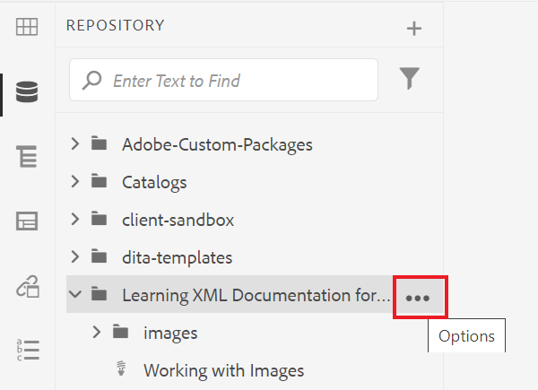
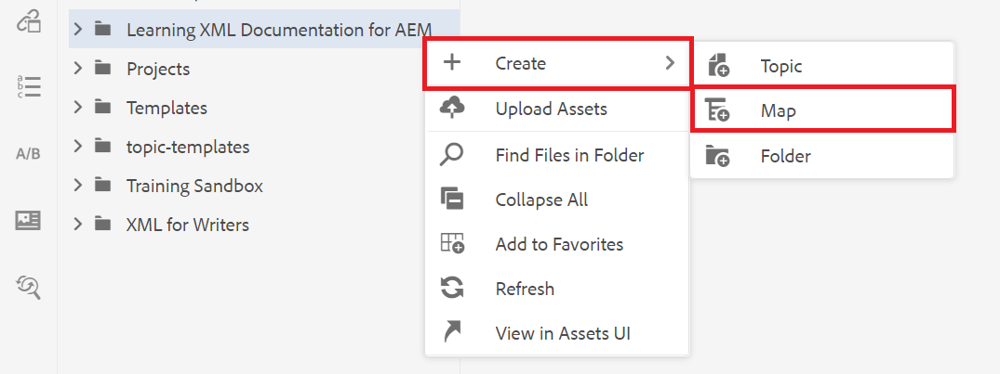
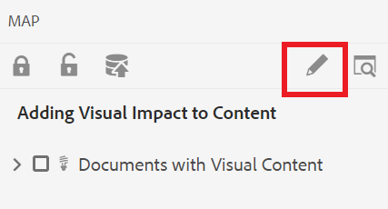

# Erstellen einer Karte

Eine Karte ist ein organisatorisches Tool, mit dem Sie Informationen in einer hierarchischen Struktur hinzufügen und organisieren können. Diese Aufgaben zeigen Ihnen, wie Sie eine Zuordnung erstellen und Inhalte in der Karte organisieren.

Sie können hier Beispiel-DITA-Dateien herunterladen:

* [documents-with-Visual-Content.dita](assets/working-with-maps/Documents-with-Visual-Content.dita)
* [Working-with-Tables.dita](assets/working-with-maps/Working-with-Tables.dita)

>[!VIDEO](https://video.tv.adobe.com/v/336725?quality=12&learn=on)

## Hochladen von Zuordnungskomponenten

Bei Bedarf können Sie lokale Beispieldateien in AEM hochladen, um eine vollständigere Materialmenge zu erhalten.

1. Ziehen Sie beliebige lokale Dateien in den AEM, um sie hochzuladen.
1. Wiederholen Sie diese Schritte nach Bedarf für alle Dateien, einschließlich Bildern und Themen.

## Erstellen einer Karte

1. So öffnen Sie die [!UICONTROL Optionen] Wählen Sie das Suchsymbol in Ihrem Hauptordner aus.

   

1. Auswählen **[!UICONTROL Erstellen]** > **[!UICONTROL Zuordnung]**.

   

   Die [!UICONTROL Neue Karte erstellen] angezeigt.

1. Im [!UICONTROL Vorlage] Feld, wählen Sie **[!UICONTROL Lesezeichen]** aus dem Dropdown-Menü und geben Sie Ihrer Karte einen Titel.
1. Wählen Sie **[!UICONTROL Erstellen]** aus.

   Ihre Zuordnung wird erstellt und die linke Leiste ändert sich automatisch von der Ansicht &quot;Repository&quot;in die Ansicht &quot;Map&quot;.

## Zuordnungskomponenten einfügen

1. Wählen Sie in der linken Leiste das Stiftsymbol aus.

   

   Dies ist das Symbol Bearbeiten und ermöglicht das Öffnen der Karte im Editor.

1. Wechseln Sie zurück zur Ansicht &quot;Repository&quot;, indem Sie auf das Symbol &quot;Repository&quot;klicken.

   

1. Fügen Sie der Zuordnung ein Thema hinzu, indem Sie es aus dem Repository in die Zuordnung im Editor ziehen und ablegen.

   Die Zeilenanzeige zeigt an, wo das Thema platziert wurde.

1. Fügen Sie nach Bedarf weitere Themen hinzu.

## Anzeigen einer Zuordnungsvorschau

Die Vorschau bietet einen schnellen Überblick über den Inhalt mit Standardformaten. Es werden die Überschriften, Absätze, Listen und alle anderen Inhalte der Themen angezeigt.

1. Auswählen **[!UICONTROL Vorschau]** aus der oberen schwarzen Menüleiste.

   

Ihr Inhalt wird geöffnet in [!UICONTROL Vorschau].

1. Um zur Autorenansicht zurückzukehren und die Zuordnungsbearbeitung fortzusetzen, wählen Sie **Autor.**

   

## Zuordnungsstruktur konfigurieren

Sie können die Hierarchie der Themen in der Zuordnung bearbeiten.

1. Klicken Sie auf das Symbol eines Themas, um es auszuwählen.
1. Verwenden Sie die Pfeile, um Elemente zu demotieren bzw. zu bewerben.

   

## Karte als neue Version speichern

Nachdem die Zuordnung abgeschlossen ist, können Sie Ihre Arbeit als neue Version speichern und Ihre Änderungen aufzeichnen.

1. Wählen Sie die **[!UICONTROL Als neue Version speichern]** Symbol.

   

1. Geben Sie im Feld Kommentare für neue Version eine kurze, aber klare Zusammenfassung der Änderungen ein.

1. Geben Sie im Feld Versionsbezeichnungen alle relevanten Bezeichnungen ein.

   Mit Beschriftungen können Sie die Version angeben, die Sie beim Veröffentlichen einbeziehen möchten.

   >[!NOTE]
   > 
   > Wenn Ihr Programm mit vordefinierten Bezeichnungen konfiguriert ist, können Sie aus diesen auswählen, um eine konsistente Beschriftung sicherzustellen.

1. Wählen Sie **Speichern** aus.

   Sie haben eine neue Version Ihrer Zuordnung erstellt und die Versionsnummer wird aktualisiert.
