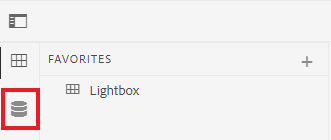
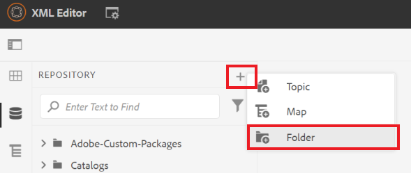
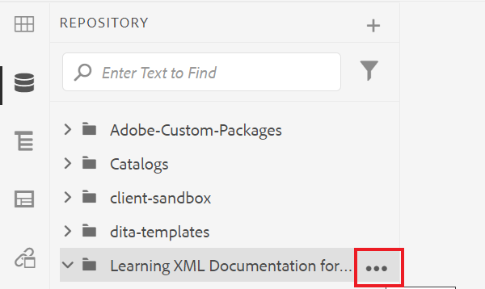
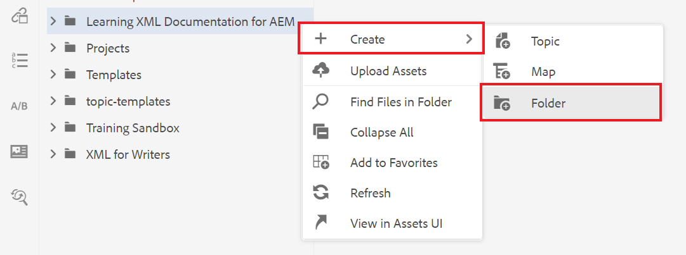
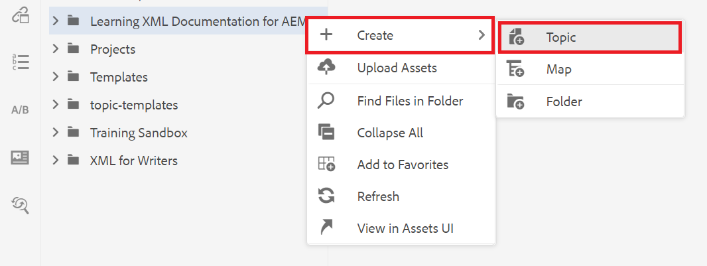
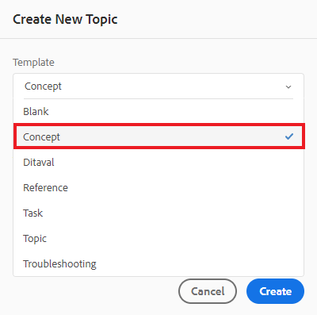
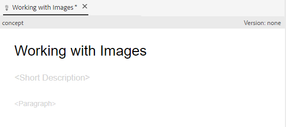

# Erstellen und Strukturieren von Inhalten

Sobald Sie sich mit der Benutzeroberfläche vertraut gemacht haben, können Sie beginnen, eigene Inhalte zu erstellen und zu strukturieren.

>[!VIDEO](https://video.tv.adobe.com/v/336657?quality=12&learn=on)

## Ordner erstellen

1. Wählen Sie die **Repository** -Symbol, um Ihre Ordner und Dateien anzuzeigen.

   

1. Wählen Sie die **+** Symbol und **Ordner**.

   
1. Geben Sie dem Ordner einen Titel.
1. Wählen Sie **Erstellen**.
Sie haben einen neuen Ordner erstellt, der jetzt im Repository angezeigt wird. Dieser Ordner wird Ihr Zuhause für alle Kursinhalte sein.

## Erstellen eines Unterordners

Jetzt können wir einen Ordner in Ihrem neuen Ordner erstellen, der Bilder oder andere Inhalte enthält.

1. Bewegen Sie den Mauszeiger über den neuen Ordner im Repository und wählen Sie das angezeigte Auslassungssymbol aus.

   

   Das Menü Optionen wird angezeigt.
1. Auswählen **Erstellen von \> Ordner**.
   

1. Geben Sie dem Unterordner einen Titel (z. B. &quot;images&quot;) und wählen Sie **Erstellen**.

## Erstellen und Ausfüllen eines neuen Konzepts

1. Bewegen Sie den Mauszeiger über den übergeordneten Ordner im Repository und wählen Sie das Auslassungssymbol aus.

   

   Das Menü Optionen wird angezeigt.
1. Auswählen **Erstellen \> Thema**.

   

   Das Dialogfeld Neues Thema erstellen wird angezeigt.

1. Wählen Sie im Dropdown-Menü Vorlage im Dialogfeld die Option **Konzept**.

   

1. Geben Sie Ihrem Konzept einen Titel und wählen Sie **Erstellen**.

   Das neue Konzept wird im Editor angezeigt und mit dem Titel gefüllt.

   

1. Füllen Sie das Konzept aus, indem Sie entweder auf die kurze Beschreibung oder den Absatz klicken und Ihren Inhalt eingeben.

## Speichern und Speichern als neue Version

Sie können Ihre Arbeit jederzeit mit Speichern oder als neue Version speichern. Verwenden Sie Speichern , um Ihre Änderungen beizubehalten, und verwenden Sie Speichern als neue Version , um eine neue Version Ihres Themas mit aktuellen Änderungen zu erstellen.

### Speichern Ihrer Arbeit ohne Versionierung

1. Wählen Sie die **Speichern** Symbol.

   

### Als neue Version speichern

1. Wählen Sie die **Als neue Version speichern** rechts neben dem Symbol Speichern.

   

   Das Dialogfeld Als neue Version speichern wird angezeigt.

1. Geben Sie im Feld Kommentare für neue Version eine kurze, aber klare Zusammenfassung der Änderungen ein.
1. Geben Sie im Feld Versionsbezeichnungen alle relevanten Bezeichnungen ein.

   Mit Beschriftungen können Sie die Version angeben, die Sie beim Veröffentlichen einbeziehen möchten.

   >[!NOTE]
   > 
   > Wenn Ihr Programm mit vordefinierten Bezeichnungen konfiguriert ist, können Sie aus diesen auswählen, um eine konsistente Beschriftung sicherzustellen.
1. Wählen Sie **Speichern** aus.

   Sie haben eine neue Version Ihres Themas erstellt und die Versionsnummer wird aktualisiert.
