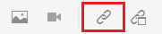
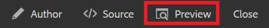
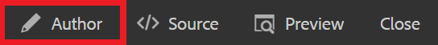

# Verknüpfen mit Websites

Über Web-Links werden Leser zu Websites weitergeleitet, auf denen sie weitere Informationen erhalten, mit externen Inhalten interagieren oder auf herunterladbare Dateien zugreifen können. In den folgenden Schritten wird erläutert, wie Sie einem vorhandenen Konzept einen Web-Link hinzufügen können.

>[!VIDEO](https://video.tv.adobe.com/v/336656?quality=12&learn=on)

## Link einfügen

1. Wählen Sie Ihr Konzept aus dem Repository aus und öffnen Sie es im Editor.
1. Fügen Sie Ihrem Konzept eine Textzeichenfolge hinzu und markieren Sie es oder markieren Sie vorhandenen Text Ihrer Wahl.

   In diesem hervorgehobenen Text wird der Link eingefügt.
1. Wählen Sie die **Querverweis einfügen** in der Symbolleiste.

   

   Das Dialogfeld &quot;Referenz&quot;wird angezeigt.

1. Auswählen **Weblink** über das Menü links.
1. Fügen Sie die gewünschte URL ein und klicken Sie auf **Auswählen**.

   Der Link ist funktionsfähig und öffnet eine Webseite in einem neuen Browser-Tab, wenn darauf geklickt wird.

## Verwenden der Vorschau zum Testen von Links

Über die Schaltfläche Vorschau können Sie eine Vorschau eines Themas anzeigen. Hier können Sie Ihre Links testen und so anzeigen, wie es Ihre Zielgruppe tun würde.

1. Auswählen **Vorschau** aus der oberen schwarzen Menüleiste.

   

   Ihr Konzept wird in der Vorschau geöffnet.

1. Wählen Sie Ihren Link aus.
Das Link-Ziel wird auf einer anderen Registerkarte geöffnet.
1. Zur Autorenansicht zurückkehren, indem Sie **Autor** aus der oberen schwarzen Menüleiste.

   

## Als neue Version speichern

Nachdem Sie Ihrem Konzept nun mehr Inhalte hinzugefügt haben, können Sie Ihre Arbeit als neue Version speichern und Ihre Änderungen aufzeichnen.

1. Wählen Sie die **Als neue Version speichern** Symbol.

   

1. Geben Sie im Feld Kommentare für neue Version eine kurze, aber klare Zusammenfassung der Änderungen ein.
1. Geben Sie im Feld Versionsbezeichnungen alle relevanten Bezeichnungen ein.

   Mit Beschriftungen können Sie die Version angeben, die Sie beim Veröffentlichen einbeziehen möchten.

   >[!NOTE]
   > 
   > Wenn Ihr Programm mit vordefinierten Bezeichnungen konfiguriert ist, können Sie aus diesen auswählen, um eine konsistente Beschriftung sicherzustellen.

1. Wählen Sie **Speichern** aus.

   Sie haben eine neue Version Ihres Themas erstellt und die Versionsnummer wird aktualisiert.
