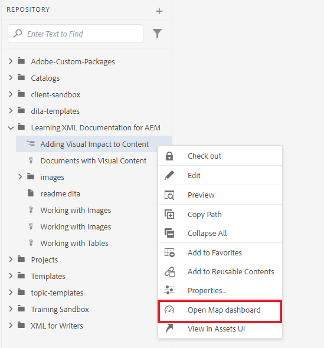
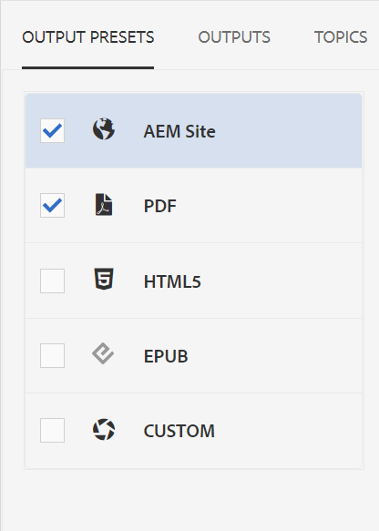
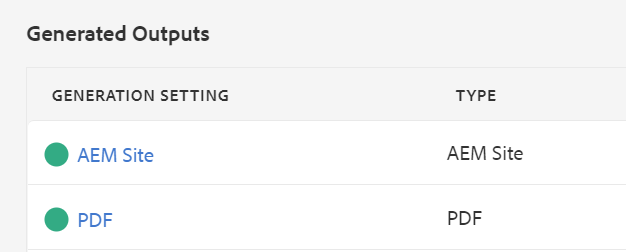

# Standardausgabe für Veröffentlichungen

Sobald Sie eine fertige Zuordnung haben, können Sie Ihren Inhalt in mehreren Ausgabeformaten veröffentlichen.

>[!VIDEO](https://video.tv.adobe.com/v/336662?quality=12&learn=on)

## Veröffentlichen Ihrer Karte als AEM Site und PDF

Es gibt eine Reihe von Ausgabevorgaben, aus denen Sie wählen können. Dieses Handbuch konzentriert sich auf die AEM Site und PDF-Ausgaben.

1. Wählen Sie im Repository das Auslassungssymbol auf Ihrer Karte aus, um das Menü &quot;Optionen&quot;zu öffnen, und klicken Sie dann auf **Öffnen Sie im Map Dashboard.**

   

   Das Zuordnungs-Dashboard wird in einer anderen Registerkarte geöffnet.

2. Wählen Sie auf der Registerkarte Ausgabevorgaben die Option AEM Site und PDF aus.

   

3. Auswählen **Generieren.**

4. Navigieren Sie zur Seite Ausgaben , um den Status Ihrer generierten Ausgaben anzuzeigen.

   Ein grüner Kreis zeigt an, dass die Erzeugung abgeschlossen ist.

   

## Die AEM Site-Ausgabe

In der Ausgabe der AEM-Site werden Themen, Listen, Bilder, Titel, Tabellen und andere mit dem XML-Editor erstellte Inhalte automatisch durch AEM in webfreundliche Inhalte veröffentlicht.

Untergeordnete Themen finden Sie im Inhaltsverzeichnis sowie im Abschnitt Verwandte Informationen . Diese Links können alle für die Navigation verwendet werden.

## Die PDF-Ausgabe

Das fertige PDF-Dokument enthält den Standardtitel der Zuordnung als Haupttitel auf der Titelseite. KapitelTitelseiten sind mit der Kapitelnummer formatiert und enthalten Links zu den Themen in .
