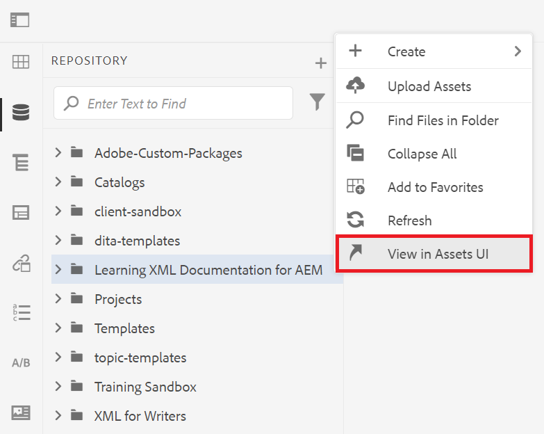
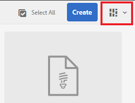
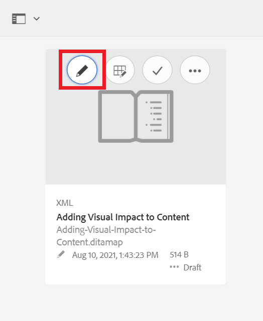

# Grundlegendes zur AEM Benutzeroberfläche

Erfahren Sie mehr über das Verwalten von Assets, Dateien und Ordnern im XML-Editor für Experience Manager.

>[!VIDEO](https://video.tv.adobe.com/v/336659?quality=12&learn=on)

## Zugriff auf den XML-Editor

1. Geben Sie auf dem Anmeldebildschirm Ihren Benutzernamen und Ihr Kennwort ein und wählen Sie **[!UICONTROL Anmelden]**.
1. Auswählen **[!UICONTROL XML-Editor]** von der AEM Navigationsseite aus.

## Ansichten des XML-Editors

In der Seitenleiste können Sie aus mehreren Ansichten für den XML-Editor wählen, um Ihre organisatorischen Anforderungen optimal zu erfüllen. Dazu gehören die Standardansicht und [!UICONTROL Repository-Ansicht].

Die Standardansicht zeigt Ihre [!UICONTROL Favoriten]. Sie können sie bei Bedarf mit Tastaturbefehlen weiter anpassen. Umgekehrt wird die [!UICONTROL Repository-Ansicht] zeigt eine eher herkömmliche Ordnerstruktur an.

### Wechseln zum [!UICONTROL Repository-Ansicht] aus der Standardansicht

1. Wählen Sie in der linken Leiste die Option **[!UICONTROL Repository-Ansicht]**.

   

   Die [!UICONTROL Repository-Ansicht] angezeigt.

## Die Assets-Benutzeroberfläche

Im [!UICONTROL Assets] -Benutzeroberfläche, die Sie

### Anzeigen von Inhalten in der Assets-Benutzeroberfläche

Sie können zusätzliche Aktionen mit Ihrem Inhalt durchführen. Eine dieser Optionen besteht darin, Ihre Datei in der Assets-Benutzeroberfläche anzuzeigen.

1. Bewegen Sie den Mauszeiger über einen Ordner oder ein Thema im Repository und wählen Sie das angezeigte Auslassungssymbol aus.

   

   Das Menü Optionen wird angezeigt.

1. Wählen Sie im Menü die Option **Ansicht in der Assets-Benutzeroberfläche.**

   

### Ansicht auswählen

Sie können aus mehreren Ansichten für die Assets-Benutzeroberfläche wählen, um die Anforderungen Ihrer Organisation optimal zu erfüllen.

1. Wählen Sie die **Switch anzeigen** rechts oben.

   

   Ein Dropdown-Menü wird angezeigt.

1. Wählen Sie die Ansicht aus, mit der Sie arbeiten möchten.

### Ansichten der Assets-Benutzeroberfläche

| Name | Beschreibung |
| --- | --- |
| Kartenansicht | Zeigt jedes Asset als Symbol an |
| Spaltenansicht | Zeigt Assets in einer gekürzten, erweiterbaren Ordnerstruktur an |
| Listenansicht | Zeigt Assets in einer Liste mit Details an |

## Zurückkehren zum XML-Editor

Sie können von jeder Ansicht der Assets-Benutzeroberfläche zum XML-Editor zurückkehren.

### Aus Listen- und Spaltenansicht zurückgeben

1. Wählen Sie in der Liste das Thema aus, das Sie bearbeiten möchten.
Das Thema wird in der Assets-Benutzeroberfläche angezeigt.
1. Auswählen **Bearbeiten** aus der oberen Symbolleiste.
Sie werden an den XML-Editor zurückgegeben.

### Aus der Kartenansicht zurückgeben

1. Wählen Sie das Stiftsymbol für ein Thema im [!UICONTROL Assets] Benutzeroberfläche.

   

   Sie werden an den XML-Editor zurückgegeben.
