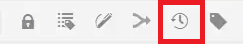

# Versionierung von Inhalten

Durch die Versionierung eines Dokuments wird eine Momentaufnahme des aktuellen Status erstellt. Wenn Sie mehrere Versionen eines Themas oder einer Zuordnung erstellen, können Sie Ihre Änderungen verfolgen und ältere Arbeiten wiederherstellen.

>[!VIDEO](https://video.tv.adobe.com/v/336724?quality=12&learn=on)

## Erstellen einer neuen Version

1. Wählen Sie das Symbol Als neue Version speichern aus.

   

   Das Dialogfeld Als neue Version speichern wird angezeigt.

1. Geben Sie im Feld Kommentare für neue Version eine kurze, aber klare Zusammenfassung der Änderungen ein.
1. Geben Sie im Feld Versionsbezeichnungen alle relevanten Bezeichnungen ein.

   Mit Beschriftungen können Sie die Version angeben, die Sie beim Veröffentlichen einbeziehen möchten.

   >[!NOTE]
   > 
   > Wenn Ihr Programm mit vordefinierten Bezeichnungen konfiguriert ist, können Sie aus diesen auswählen, um eine konsistente Beschriftung sicherzustellen.
1. Wählen Sie **Speichern** aus.

   Sie haben eine neue Version Ihres Themas erstellt und die Versionsnummer wird aktualisiert. Die erste Version eines Dokuments ist Version 1.0.

## Anzeigen des Versionsverlaufs

Sobald Sie mehrere Versionen Ihres Inhalts haben, sollten Sie die Unterschiede zwischen diesen Versionen untersuchen.

1. Wählen Sie in der Symbolleiste das Symbol Versionsverlauf aus.

   

   Das Dialogfeld Versionsverlauf wird angezeigt.

1. Wählen Sie eine Version aus dem Dropdown-Menü aus, um Ihre aktuelle Version mit der Version zu vergleichen.

   Ihre Änderungen von Version zu Version werden angezeigt.

## Wiederherstellen einer ausgewählten Version

Bei Bedarf können Sie eine Version auswählen und sie wiederherstellen. Dadurch können Sie die aktuelle Version verwerfen und mit einer früheren Version arbeiten.

1. Wählen Sie im Dialogfeld Versionsverlauf die Version aus, zu der Sie zurückkehren möchten.
1. Auswählen **Auf ausgewählte Version zurücksetzen**.

Das Dialogfeld Version wiederherstellen wird angezeigt.

1. Fügen Sie einen beschreibenden Kommentar hinzu, warum Sie auf eine frühere Version zurücksetzen.
1. Auswählen **Bestätigen**.

   Ihr Thema wurde auf die spezifische Version zurückgesetzt.

## Verwenden von Filtern zum Vergleichen von Versionen

Sie können auch Versionsunterschiede in der Vorschau anzeigen, indem Sie die Filter Tracking und Unterschiede anzeigen in der rechten Leiste verwenden.

1. Auswählen **Vorschau** aus der oberen Menüleiste.

   

   Ihr Thema wird in der Vorschau geöffnet.

1. Wählen Sie im Dropdown-Menü Tracking in der rechten Leiste die Option **Markup anzeigen**.
1. Wählen Sie im Dropdown-Menü Unterschiede anzeigen die Version aus, mit der Sie vergleichen möchten.

   Ihre Änderungen werden als formatierter Inhalt angezeigt.
