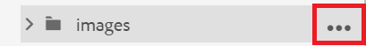
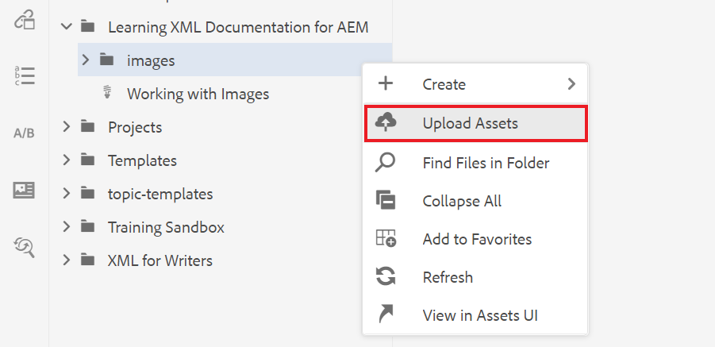
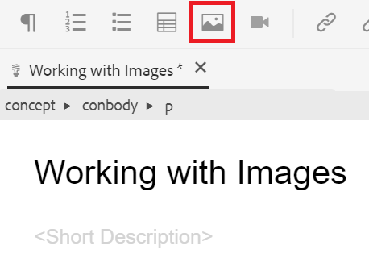
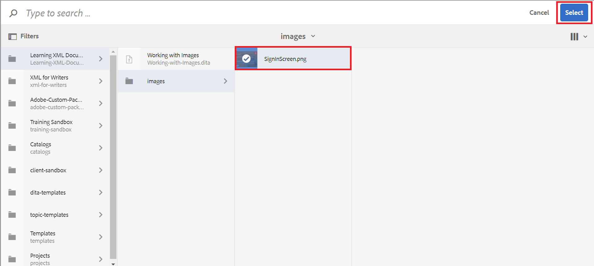

# Arbeiten mit Bildern

Im Folgenden erfahren Sie, wie Sie ein Bild hochladen und einfügen sowie eine neue Version eines Themas speichern.

Sie können die Beispielbilddatei von [hier.](assets/working-with-images/SignInScreen.png)

>[!VIDEO](https://video.tv.adobe.com/v/336661?quality=12&learn=on)

## Hochladen eines Bildes

1. Bewegen Sie den Mauszeiger über den Unterordner und wählen Sie das Auslassungssymbol aus, um das Menü &quot;Optionen&quot;zu öffnen.

   

1. Auswählen **[!UICONTROL Hochladen von Assets]**.

   

1. Wählen Sie das Bild aus, das Sie von Ihrem lokalen System hochladen möchten, und wählen Sie **Öffnen**.

   Die [!UICONTROL Hochladen von Assets] angezeigt.

1. Wählen Sie **Hochladen**.

## Einfügen eines Bildes in ein Thema

Es gibt mehrere Möglichkeiten, ein Bild in Ihr Thema einzufügen.

Sie können ein Bild aus Ihrem lokalen System per Drag-and-Drop in Ihr Thema ziehen. Wenn das Bild bereits hochgeladen wurde, können Sie es auch direkt aus der linken Leiste in das Thema ziehen. Alternativ können Sie die Schaltfläche Bild einfügen verwenden, um Bilder einzufügen, die derzeit nicht in der linken Leiste sichtbar sind, und das Bild vor dem Einfügen weiter zu konfigurieren.

Stellen Sie für Folgendes sicher, dass Ihr Thema im Dokumenteditor geöffnet ist.

### Bild per Drag &amp; Drop einfügen

1. Wählen Sie die Bilddatei aus Ihrem lokalen System oder der linken Leiste aus und ziehen Sie sie per Drag-and-Drop in Ihr Thema.

   Ihr Bild wird im Editor angezeigt.

### Einfügen eines Bildes mit der Schaltfläche &quot;Bild einfügen&quot;

1. Wählen Sie die **Bild einfügen** Symbol.

   

   Das Dialogfeld Bild einfügen wird angezeigt.

1. Wählen Sie das Ordnersymbol neben dem Feld Datei auswählen aus, um nach Ihrem Bild zu suchen oder zu dessen Speicherort im Repository zu navigieren.
1. Wählen Sie das Bildsymbol und dann **Auswählen**.

   

   Das Dialogfeld Bild einfügen wird mit den Informationen des ausgewählten Bildes angezeigt.

1. Geben Sie bei Bedarf Text in die Felder &quot;Titel der Abbildung&quot;und &quot;Alternativtext&quot;ein.
1. Auswählen **Einfügen**.

   Das Bild wird zusammen mit dem Titel der Abbildung im Editor angezeigt.

## Entfernen eines Bildes aus einem Thema

1. Wählen Sie das Bild im Dokumenteditor aus und drücken Sie die **Löschen** Schlüssel.

## Speichern einer neuen Version eines Themas

Mit der Versionierung können Sie verschiedene Versionen überprüfen und vergleichen. Sie können sogar auf eine frühere Version zurücksetzen.

Da Sie eine wichtige Änderung an Ihrem Thema vorgenommen haben, kann es jetzt nützlich sein, Ihre aktuelle Arbeit als neue Version zu speichern.

1. Wählen Sie die **Als neue Version speichern** Symbol.

   

   Die **Als neue Version speichern** angezeigt.

1. Geben Sie im Feld Kommentare für neue Version eine kurze, aber klare Zusammenfassung der Änderungen ein.
1. Geben Sie im Feld Versionsbezeichnungen alle relevanten Bezeichnungen ein.

   Mit Beschriftungen können Sie die Version angeben, die Sie beim Veröffentlichen einbeziehen möchten.

   >[!NOTE]
   > 
   > Wenn Ihr Programm mit vordefinierten Bezeichnungen konfiguriert ist, können Sie aus diesen auswählen, um eine konsistente Beschriftung sicherzustellen.

1. Wählen Sie **Speichern** aus.

   Sie haben eine neue Version Ihres Themas erstellt und die Versionsnummer wird aktualisiert.
