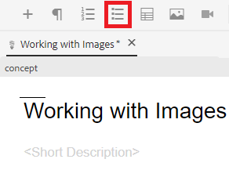
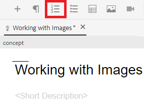

# Arbeiten mit Listen

Sie benötigen möglicherweise Listen mit Aufzählungszeichen und Nummerierungen, um Ihre Informationen zu organisieren. Im Folgenden erfahren Sie, wie Sie Listen in einem vorhandenen Konzept einfügen und verwenden können.

>[!VIDEO](https://video.tv.adobe.com/v/336658?quality=12&learn=on)

## Aufzählungslisten

Eine Liste mit Aufzählungszeichen oder unsortierten Elementen sollte verwendet werden, wenn Listenkomponenten nicht in einer bestimmten Reihenfolge angeordnet werden müssen.

### Liste mit Aufzählungszeichen einfügen

1. Wählen Sie die **Aufzählungsliste einfügen** in der Symbolleiste.

   

   Ein Punkt mit Aufzählungszeichen wird angezeigt. Dies ist der Anfang Ihrer Liste.

1. Geben Sie Ihren ersten Listeneintrag ein.
1. Drücken Sie die Eingabetaste , um einen zweiten Eintrag zu erstellen und den Inhalt einzugeben.
1. Fügen Sie nach Bedarf weitere Listenelemente hinzu.

## Nummerierte Listen

Eine nummerierte Liste sollte verwendet werden, wenn Listenkomponenten in einer bestimmten Reihenfolge angeordnet oder strukturiert werden müssen.

### Einfügen einer geordneten Liste

1. Wählen Sie die **Nummerierte Liste einfügen** in der Symbolleiste.

   

   Eine Zahl wird angezeigt. Dies ist der Anfang Ihrer Liste.

1. Geben Sie Ihren ersten Listeneintrag ein.
1. Drücken Sie die Eingabetaste , um einen zweiten Eintrag zu erstellen und den Inhalt einzugeben.
1. Fügen Sie nach Bedarf weitere Listenelemente hinzu.

## Als neue Version speichern

Nachdem Sie Ihrem Konzept nun mehr Inhalte hinzugefügt haben, können Sie Ihre Arbeit als neue Version speichern und Ihre Änderungen aufzeichnen.

1. Wählen Sie die **Als neue Version speichern** Symbol.

   

1. Geben Sie im Feld Kommentare für neue Version eine kurze, aber klare Zusammenfassung der Änderungen ein.
1. Geben Sie im Feld Versionsbezeichnungen alle relevanten Bezeichnungen ein.

   Mit Beschriftungen können Sie die Version angeben, die Sie beim Veröffentlichen einbeziehen möchten.

   >[!NOTE]
   > 
   > Wenn Ihr Programm mit vordefinierten Bezeichnungen konfiguriert ist, können Sie aus diesen auswählen, um eine konsistente Beschriftung sicherzustellen.

1. Wählen Sie **Speichern** aus.

   Sie haben eine neue Version Ihres Themas erstellt und die Versionsnummer wird aktualisiert.
