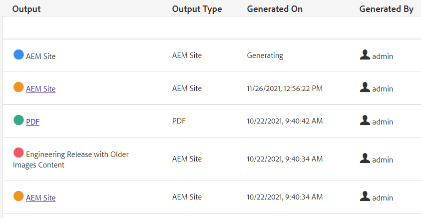

# Massenveröffentlichung

Bei der Veröffentlichung sind häufig mehr als eine Art von Dokumentation erforderlich. Mithilfe von Sammlungen zuordnen können Sie die Anzahl und die Arten der Ausgabe steuern, die assembliert und generiert werden und die Massenveröffentlichung starten. Im Dashboard &quot;Veröffentlichen&quot;können Sie aktive Veröffentlichungsaufträge anzeigen. Das Dashboard für die Massenveröffentlichung bietet eine Möglichkeit, Sammlungen stapelweise zu aktivieren.

>[!VIDEO](https://video.tv.adobe.com/v/338985?quality=12&learn=on)

## Arbeiten mit Sammlungen zuordnen

Mithilfe von Sammlungen zuordnen können Sie die Ausgabetypen steuern, die für eine oder mehrere Zuordnungen generiert werden.

### Erstellen von Zuordnungssammlungen

1. Klicken Sie im Navigationsmenü auf **Assets**.

1. Wählen Sie Sammlungen zuordnen aus.

1. Klicken Sie auf **Erstellen**.

1. Geben Sie einen Sammlungstitel ein.

   

1. Klicken Sie auf **Erstellen**.
1. Schließen Sie die Erfolgsmeldung.

1. Öffnen Sie die Zuordnungssammlung (klicken Sie auf den grauen Abschnitt unter der Kachel).

1. Klicken Sie auf **Bearbeiten**.

1. Fügen Sie nach Bedarf Zuordnungen hinzu.

1. Auswählen oder Aufheben der Auswahl **Ausgabevorgaben** für jede Karte.
1. Klicken Sie auf **Fertig**.

### Filtern von Zuordnungsvorgaben

1. Öffnen Sie eine Zuordnungsvorgabe.

1. under **Filter** Erweitern Sie die Optionen und wählen Sie sie nach Bedarf aus.

### Generieren von Inhalten in einer Map Collection

1. Öffnen Sie eine Zuordnungsvorgabe.

1. Klicken Sie bei Bedarf auf **Alle generieren**.

1. ODER wählen Sie die Karten und Ausgabetypen aus, die generiert werden sollen, und klicken Sie auf **Ausgewählte generieren**.

1. Wechseln Sie bei Bedarf zum Tab Ausgaben .

1. Überprüfen Sie die Ausgabe.

## Anzeigen aktiver Veröffentlichungsaufträge im Veröffentlichungs-Dashboard

Im Dashboard &quot;Veröffentlichen&quot;können Sie aktive Veröffentlichungsaufträge anzeigen. Es zeigt eine dynamische Liste von Karten und deren aktuellen Status an. Sie können Veröffentlichungs-Workflows verfolgen, verwalten oder abbrechen.

1. Klicken Sie in der Navigationsansicht auf die **Instrumente** Symbol.

1. Klicken Sie auf **[!DNL Guides]**.

1. Wählen Sie die **Dashboard veröffentlichen** Kachel.

       Wenn das Dashboard leer ist, werden keine Veröffentlichungsaufträge ausgeführt.
       
   
1. Filtern Sie das Dashboard nach Bedarf, um alle Veröffentlichungsaufträge anzuzeigen.

### Arbeiten mit dem Massen-Veröffentlichungs-Dashboard

Mit dem Dashboard für die Massenveröffentlichung können Sie mit Massenaktivierungssammlungen arbeiten und mehrere Ausgabetypen steuern.

### Erstellen einer Massenaktivierungskollektion

1. Klicken Sie in der Navigationsansicht auf die **Instrumente** Symbol.

1. Klicken Sie auf **[!DNL Guides]**.

1. Wählen Sie die **Massen-Veröffentlichungs-Dashboard** Kachel.

1. Geben Sie einen Sammlungstitel ein.

1. Klicken Sie auf **Erstellen**.

1. Klicken **Öffnen**.

1. Öffnen Sie die Zuordnungssammlung (klicken Sie auf den grauen Abschnitt unter der Kachel).

1. Klicken Sie auf **Bearbeiten**.

1. Fügen Sie nach Bedarf Zuordnungen hinzu.

1. Auswählen oder Aufheben der Auswahl **Ausgabevorgaben** für jede Karte.
1. Klicken Sie auf **Fertig**.
1. Schließen Sie die Zuordnungssammlung, wenn Sie fertig sind.

### Quick Publish a Bulk Activation Collection

1. Wählen Sie die Kachel Massenaktivierung - Sammlung aus.
1. Klicken **Öffnen**.
1. Wählen Sie eine oder mehrere Maps aus.
1. Klicken **Quick Publish**.
