# Erstellen und Veröffentlichen mit Grundlinien

Mithilfe einer Grundlinie können Sie eine Version Ihrer Zuordnungsthemen und zugehörigen Referenzinhalte erstellen. Dies kann auf einem bestimmten Datum, einer bestimmten Uhrzeit oder auf Bezeichnungen basieren.

>[!VIDEO](https://video.tv.adobe.com/v/338993?quality=12&learn=on)

## Zugriff auf die Registerkarte &quot;Grundlinien&quot;im Map Dashboard

Sie können auf Ihre Grundlinien im Map Dashboard zugreifen.

1. Repository-Ansicht, wählen Sie auf Ihrer Karte das Symbol Auslassungspunkte aus, um das Menü &quot;Optionen&quot;zu öffnen, und klicken Sie dann auf **Öffnen Sie das Map Dashboard.**

   
Das Zuordnungs-Dashboard wird in einer anderen Registerkarte geöffnet.

2. Auswählen **Grundlinien**.

   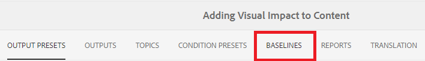

Die Registerkarte Grundlinien wird angezeigt.

## Erstellen einer Grundlinie basierend auf Bezeichnungen

1. Wählen Sie auf der Registerkarte Grundlinien die Option **Erstellen**.

   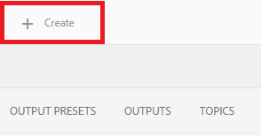

   Die Informationen der neuen Grundlinie werden angezeigt. Der Standardname basiert auf dem Erstellungsdatum.

2. Benennen Sie bei Bedarf Ihre Grundlinie neu.

3. Wählen Sie unter der Überschrift &quot;Version basierend auf festlegen&quot;den Kreis für Beschriftung aus.
   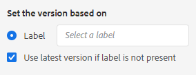

   >[!NOTE]
   >
   >HINWEIS: Die *Verwenden Sie die neueste Version, wenn die Beschriftung nicht vorhanden ist.* ist standardmäßig aktiviert. Wenn diese Option nicht ausgewählt ist und Themen oder Mediendateien ohne die ausgewählte Beschriftung in Ihrer Zuordnung vorhanden sind, schlägt der Prozess zur Erstellung der Grundlinie fehl.

4. Geben Sie den Titel ein, den Sie verwenden möchten.

5. Wählen Sie **Speichern** aus.

Ihre Grundlinie wird erstellt. Eine Tabelle aller Themen und der zugehörigen Informationen wird angezeigt.

### Verwenden der Funktion &quot;Alle Themen durchsuchen&quot;

Mit der Funktion &quot;Alle Themen durchsuchen&quot;können Sie die Informationen des Themas, einschließlich der Version und des Titels, sowie die verwendete Version anzeigen. Sie können darauf zugreifen, indem Sie **Alle Themen durchsuchen** beim Erstellen oder Bearbeiten Ihrer Grundlinie.

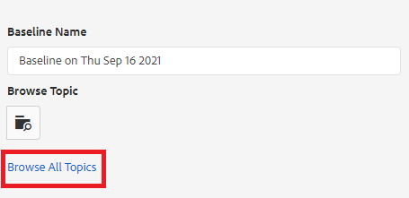

## Erstellen einer Grundlinie basierend auf Datum und Uhrzeit

Sie können auch Grundlinien erstellen, die Momentaufnahmen sind.

1. Stellen Sie sicher, dass die Registerkarte &quot;Grundlinien&quot;geöffnet ist, und wählen Sie Erstellen aus.

   

2. Wählen Sie unter der Überschrift &quot;Version basierend auf festlegen&quot;den Kreis für &quot;Version ein&quot;.

   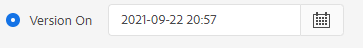

3. Wählen Sie das Kalendersymbol aus und geben Sie das gewünschte Datum und die gewünschte Uhrzeit an.

   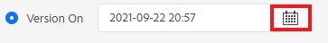

4. Benennen Sie bei Bedarf Ihre Grundlinie neu.

5. Wählen Sie **Speichern** aus.

Ihre Grundlinie wird erstellt. Eine Tabelle aller Themen und der zugehörigen Informationen wird angezeigt.

### Hinzufügen von Bezeichnungen zur Grundlinie

Möglicherweise möchten Sie allen Inhalt Ihrer Zuordnung eine neue Bezeichnung stapelweise zuweisen.

1. Wählen Sie die Grundlinie aus, für die Sie Beschriftungen hinzufügen möchten.

2. Auswählen **Hinzufügen von Bezeichnungen**.

   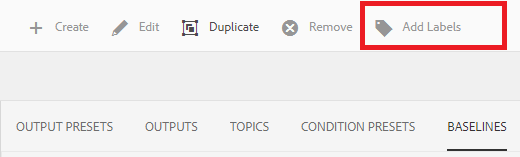

   Das Dialogfeld Titel hinzufügen wird angezeigt.

3. Geben Sie den Titel ein, den Sie zuweisen möchten, und wählen Sie **Hinzufügen**.

Der Titel wurde allen Themen hinzugefügt.

## Generieren einer AEM Site-Ausgabe mithilfe einer Grundlinie

1. Navigieren Sie im Map Dashboard zur Registerkarte Ausgabevorgaben .

2. Aktivieren Sie das Kontrollkästchen AEM Site .

   

3. Wählen Sie **Bearbeiten** aus.

   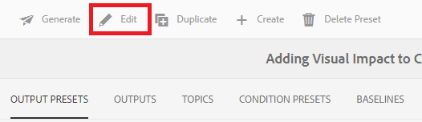

   Eine neue Seite wird angezeigt.

4. Aktivieren Sie das Kontrollkästchen Grundlinie verwenden und wählen Sie die gewünschte Grundlinie aus der Dropdown-Liste aus.

   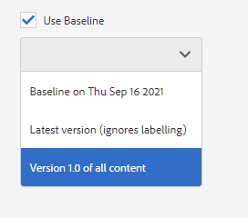

5. Klicken Sie auf **Fertig**.

   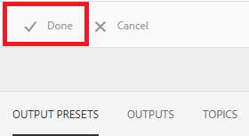

6. Auswählen **Erzeugen**.

   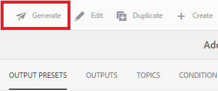

   Ihre Ausgabe wurde mit einer Grundlinie generiert.

## Anzeigen der generierten Ausgabe

1. Navigieren Sie im Map Dashboard zur Registerkarte Ausgaben .

2. Wählen Sie den Text in der Spalte Generierungseinstellung aus, um die Ausgabe zu öffnen.
   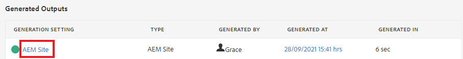

## Entfernen einer Grundlinie

1. Wählen Sie im Tab Grundlinien die Grundlinie aus, die Sie entfernen möchten.

2. Auswählen **Entfernen**.

   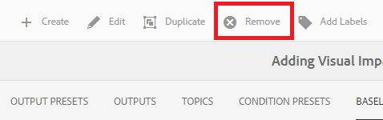

   Das Dialogfeld &quot;Grundlinie entfernen&quot;wird angezeigt.

3. Auswählen **Entfernen**.

Die Grundlinie wird entfernt.

## Duplizieren einer Grundlinie

1. Wählen Sie im Tab Grundlinien die Grundlinie aus, die Sie duplizieren möchten.

2. Auswählen **Duplizieren**.

   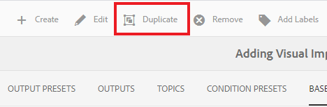

3. Wählen Sie **Speichern** aus.

   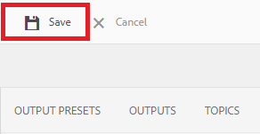

Die doppelte Grundlinie wird erstellt.

## Ändern einer Grundlinie

Sie können direkt die Version eines Themas angeben, das in einer Grundlinie verwendet wird.

1. Wählen Sie im Tab Grundlinien die Grundlinie aus, die Sie ändern möchten.
2. Wählen Sie **Bearbeiten** aus.

   

3. Auswählen **Alle Themen durchsuchen**.

   

   Eine Tabelle mit Themen und den zugehörigen Informationen wird angezeigt.

4. Wählen Sie für die Themen, die Sie ändern möchten, die gewünschte Version aus dem Dropdown-Menü unter der Spalte Version aus.

   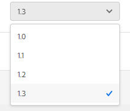

5. Wählen Sie **Speichern** aus.

Ihre Änderungen wurden gespeichert. Ihre Grundlinie verwendet nun die Versionen des von Ihnen angegebenen Themas.

## Erstellen einer benutzerdefinierten AEM Site-Ausgabevorgabe

Es ist schwierig, im Tab Ausgaben zwischen Standardausgaben desselben Typs zu unterscheiden. Mithilfe einer benutzerdefinierten Ausgabevorgabe mit einem eindeutigen und benutzerfreundlichen Namen können Sie dieses Problem beheben.

In diesem Fall erstellen wir eine Ausgabevorgabe basierend auf einer Grundlinie.

1. Navigieren Sie im Map Dashboard zur Registerkarte Ausgabevorgaben .

2. Wählen Sie **Erstellen** aus.

   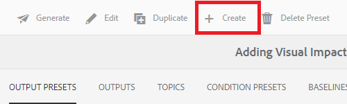

   Es wird eine neue Seite mit der Ausgabevorgabe namens &quot;Neue Ausgabe&quot;angezeigt.
3. Geben Sie im Feld &quot;Einstellungsname&quot;einen benutzerfreundlichen Namen ein.

4. Aktivieren Sie das Kontrollkästchen Grundlinie verwenden und wählen Sie die gewünschte Grundlinie aus dem Dropdown-Menü aus.

   

5. Klicken Sie auf **Fertig**.

Ihre neue Ausgabevorgabe wurde erstellt und wird auf der Seite &quot;Ausgabevorgaben&quot;angezeigt.
