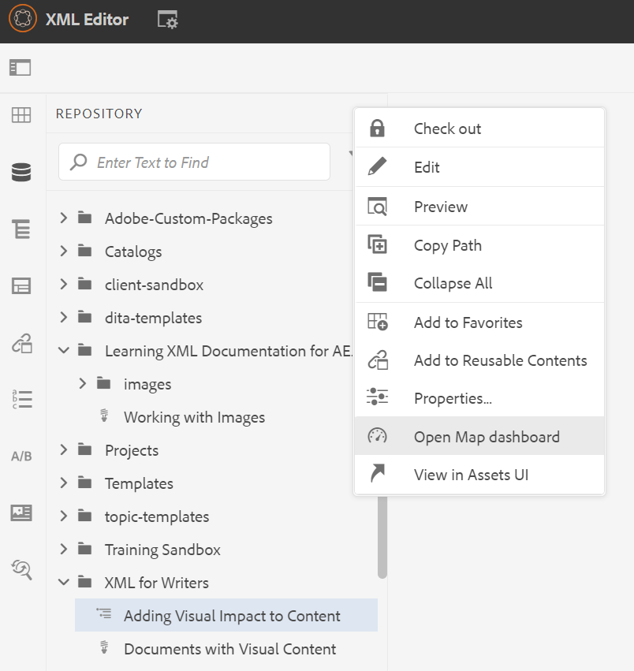

# Einführung in das Map-Dashboard

Im Folgenden finden Sie einen Überblick über die wichtigsten Funktionen des Landkarten-Dashboards.

>[!VIDEO](https://video.tv.adobe.com/v/339040?quality=12&learn=on)

## Karte im Map Dashboard öffnen

1. Wählen Sie in der Repository-Ansicht das Auslassungssymbol auf Ihrer Karte aus, um das Menü &quot;Optionen&quot;zu öffnen, und öffnen Sie dann das Map-Dashboard.
   

   Das Zuordnungs-Dashboard wird in einer anderen Registerkarte geöffnet.

## Komponenten des Map-Dashboards

Das Map Dashboard enthält eine Reihe von Registerkarten, darunter Ausgabevorgaben, Ausgabeergebnisse, verwendetes Thema, Grundlinien und mehr.

### Ausgabevorgaben

Auf der Registerkarte Ausgabevorgaben werden die Standardvorgaben für die verschiedenen Ausgabetypen angezeigt: AEM Site, PDF, HTML5, ePub und benutzerdefiniert.

Sie können eine Ausgabevorgabe auswählen, um die Details ihrer Einstellungen anzuzeigen, einschließlich des Transformationsnamens, des Zielpfads, der Grundlinien und der angewendeten Bedingungen.

### Ausgaben:

Im Tab Ausgaben werden alle zuvor generierten und derzeit generierten Ausgaben angezeigt.

Ein grüner Kreis unter der Spalte &quot;Generierungseinstellungen&quot;zeigt an, dass die Ausgabe erfolgreich generiert wurde. Der Text in dieser Spalte dient als aktiver Hyperlink und Sie können ihn auswählen, um die generierte Ausgabe zu öffnen. Die Einträge in der Spalte Typ geben den Ausgabetyp an.
Hier werden auch weitere Informationen zur Ausgabegenerierung angezeigt, darunter der Name des Benutzers, der die Ausgabe generiert hat, das Datum und die Uhrzeit der Generierung sowie die Zeit, die bis zur Generierung benötigt wurde. Wenn bei der Generierung ein Fehler auftritt, können Sie das Datum und die Uhrzeit der Generierung in der Spalte Generiert am auswählen, um das Fehlerprotokoll zu öffnen und zu überprüfen.

### Themen

Auf der Registerkarte Themen wird eine Liste aller Themen auf der Karte angezeigt.

Wenn Sie das Kontrollkästchen eines Themas aktivieren, können Sie weitere Aktionen durchführen. Sie können sie bearbeiten, neu generieren und die Tags anzeigen, anwenden oder ausblenden.

### Bedingungsvorgaben

Auf der Registerkarte Bedingungsvorgaben werden die Einstellungen für bestimmte bedingte Inhalte angezeigt, die ein- oder ausgeschlossen werden sollen.

Wenn Sie hier das Kontrollkästchen für die Bearbeitung &quot;Nur Writer&quot;aktivieren, wird eine Ausgabe ausgegeben, in der alle Inhalte mit dem Attribut &quot;Zielgruppe&quot;ausgeschlossen sind, das die Bezeichnung &quot;Designer&quot;aufweist, und alle Inhalte mit der Bezeichnung &quot;Autoren&quot;enthält.

### Grundlinien

Im Tab Grundlinien können Sie Ihre Grundlinien anzeigen.

Grundlinien dienen als Momentaufnahmen und ermöglichen es Ihnen, eine Version Ihrer Themen und Assets zur Veröffentlichung zu erstellen. Beispielsweise kann eine Grundlinie, die Inhalte zu einem bestimmten Datum und zu einer bestimmten Uhrzeit erfasst, Version 1.3 eines Themas und Version 1.0 eines anderen Themas verwenden, basierend auf ihren jeweiligen Versionen zu diesem Zeitpunkt.
Wenn keine Grundlinie angegeben ist, wird die Ausgabe mit den neuesten Versionen des gesamten Inhalts generiert.

### Berichte

Auf der Registerkarte Berichte wird eine Zusammenfassung der Themeninformationen angezeigt, einschließlich der Anzahl der insgesamt verwendeten Themen, der fehlenden Elemente in diesen Themen und des Dokumentstatus.

Wenn einem Thema ein Element fehlt, können Sie den Pfeil ganz rechts in der Zeile auswählen, um den Eintrag zu erweitern und Details zum Fehler anzuzeigen.
