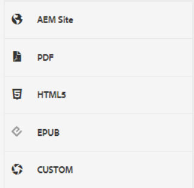
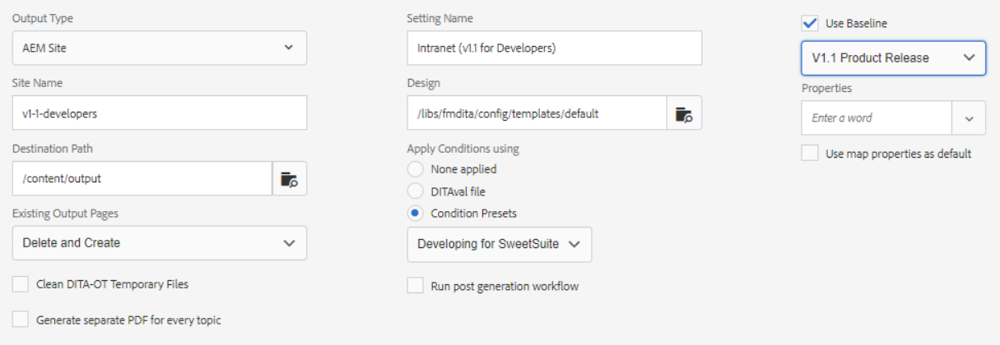

# Ausgabevorgaben

Eine Ausgabevorgabe ist eine Sammlung von Veröffentlichungseigenschaften, die einer Zuordnung zugewiesen wurden. Diese können bei Bedarf erstellt oder geändert werden.

>[!VIDEO](https://video.tv.adobe.com/v/338989?quality=12&learn=on)

## Zugreifen auf Ausgabevorgaben

Eine Ausgabevorgabe wird angezeigt, wenn eine Zuordnung im XML-Editor im Map Dashboard geöffnet wird. Vorgaben können Informationen zu einem bestimmten Ausgabetyp, Zielpfad, Anweisungen zum Verwalten vorhandener Ausgabeseiten und andere Einstellungen enthalten, die auf eine Zuordnung angewendet werden können, um Ausgaben zu generieren.

## Erstellen einer Ausgabevorgabe

>[!NOTE]
>
>HINWEIS: Einige der von einer Ausgabevorgabe verwendeten Funktionen hängen möglicherweise von der ersten Entwicklung einer Grundlinie oder einer Bedingungsvorgabe ab. Falls erforderlich, müssen Sie sie mithilfe der entsprechenden Registerkarten konfigurieren.

1. Wählen Sie eine Grundlinien-Ausgabevorgabe aus. Beispielsweise können AEM oder PDF ausgewählt werden, wenn die neue zu erstellende Vorgabe für eine Site oder Adobe PDF-Inhalte bestimmt ist.

1. Klicken Sie auf **Erstellen**.

1. Wählen Sie bei Bedarf einen Ausgabetyp aus.

1. Konfigurieren Sie die Optionen je nach Ausgabetyp weiter.

1. Klicken Sie auf **Fertig**.

## Eine Ausgabevorgabe bearbeiten

Ausgabevorgaben sind vordefiniert, können aber nach Bedarf angepasst werden.

1. Öffnen Sie das Map Dashboard.

1. Wählen Sie die **Ausgabevorgaben** Registerkarte.

1. Wählen Sie eine Ausgabevorgabe aus.

1. Klicken Sie auf **Bearbeiten**.

1. Ändern Sie die Einstellungen nach Bedarf.

   

1. Klicken Sie auf **Fertig**.
