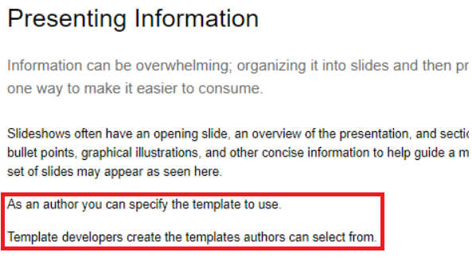
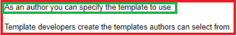
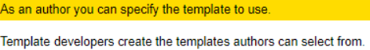
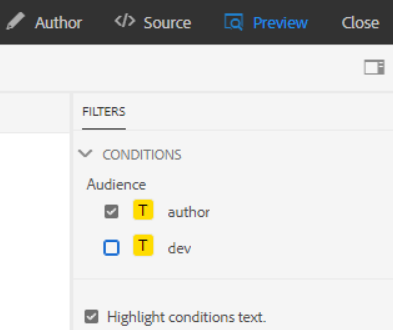
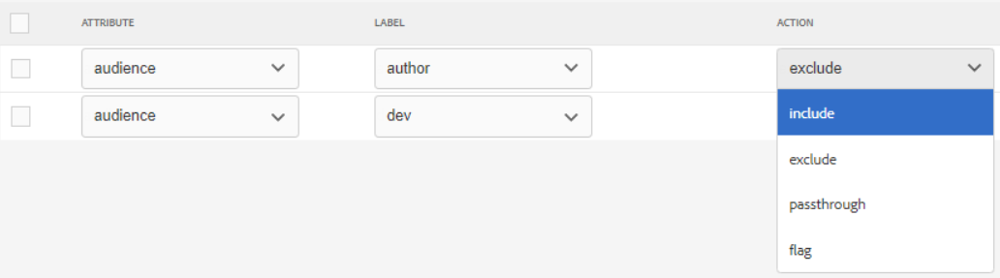
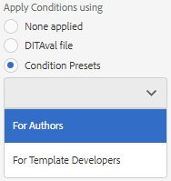
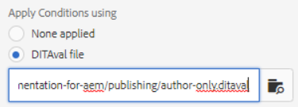

# Veröffentlichung mit Bedingungen

Durch die bedingte Veröffentlichung kann eine Inhaltsquelle für eine oder mehrere Zielgruppen, Produkte oder Plattformen geschrieben werden. Diese Informationen können dann dynamisch veröffentlicht werden und nur speziell erforderliche Inhalte, die in der Ausgabe enthalten sind.

>[!VIDEO](https://video.tv.adobe.com/v/339041)

## Vorbereitung der Übung

Hier können Sie Beispieldateien für die Übung herunterladen.

[Übung-Download](assets/exercises/publishing-with-conditions.zip)

## Markieren von Inhalten mit bedingten Attributen

1. Öffnen Sie das zu ändernde Thema.

2. Geben Sie den Text ein, der an Bedingungen geknüpft werden soll. Beispielsweise einen oder mehrere Absätze, eine gesamte Tabelle, eine Abbildung oder andere Inhalte.

   

3. Wählen Sie den spezifischen Inhalt aus, dem ein bedingtes Attribut zugewiesen werden soll. Beispielsweise einen einzelnen Absatz innerhalb der Quelle.

   

4. Stellen Sie in der rechten Leiste sicher, dass die Eigenschaften angezeigt werden.

5. Fügen Sie ein Attribut für Zielgruppe, Produkt oder Plattform hinzu.

6. Weisen Sie dem Attribut einen Wert zu. Die Inhaltsanzeige wurde aktualisiert, um bedingte Markierungen anzuzeigen.

   

## Vorschau bedingter Inhalte

1. Klicken Sie auf **Vorschau**. 

2. under **Filter**, wählen Sie die ein- oder auszublendenden Bedingungen aus oder heben Sie die Auswahl auf.

3. Auswählen oder Aufheben der Auswahl **Text für Bedingungen hervorheben**.

   

## Bedingungsvorgabe erstellen

Eine Bedingungsvorgabe ist eine Sammlung von Eigenschaften, die definieren, was während der Generierung der Ausgabe ein- oder ausgeschlossen bzw. anderweitig markiert werden soll.

1. Wählen Sie im Map Dashboard die **Bedingungsvorgaben** Registerkarte.

2. Klicken Sie auf **Erstellen**.

3. Auswählen **Hinzufügen** (oder **Alle hinzufügen**).

4. Benennen Sie die Bedingung.

5. Wählen Sie eine Kombination aus Attribut, Titel und Aktion aus.

   

6. Wiederholen Sie dies nach Bedarf.

7. Klicken Sie auf **Speichern**.

## Bedingte Ausgabe generieren

Sobald Bedingungen auf Inhalte angewendet wurden, können sie als Ausgabe generiert werden. Dies kann entweder eine Bedingungsvorgabe oder eine DITAval-Datei verwenden.

## Bedingte Ausgabe mithilfe einer Bedingungsvoreinstellung generieren

1. Wählen Sie die **Ausgabevorgaben** Registerkarte.

2. Wählen Sie eine Ausgabevorgabe aus.

3. Klicken Sie auf **Bearbeiten**.

4. under **Anwenden einer Bedingung mithilfe von** Wählen Sie eine Bedingungsvorgabe aus.

   

5. Klicken Sie auf **Fertig**.

6. Generieren Sie die Ausgabevorgabe und überprüfen Sie den Inhalt.

## Generieren einer bedingten Ausgabe mit einer DITAval-Datei

Die DITAval-Datei kann verwendet werden, um bedingte Inhalte zu veröffentlichen. Dazu muss eine Datei erstellt oder hochgeladen und dann bei der Veröffentlichung referenziert werden.

1. Wählen Sie die **Ausgabevorgaben** Registerkarte.

2. Wählen Sie eine Ausgabevorgabe aus.

3. Klicken Sie auf **Bearbeiten**.

4. Wählen Sie unter &quot;Bedingungen anwenden mit&quot;eine DITAval-Datei aus.

   

5. Klicken Sie auf **Fertig**.

6. Generieren Sie die Ausgabevorgabe und überprüfen Sie den Inhalt.
