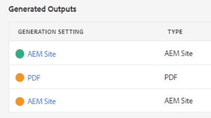
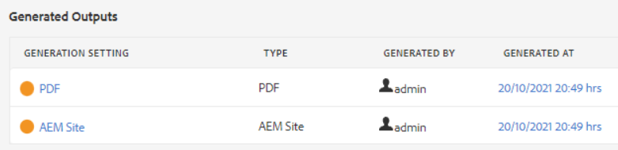
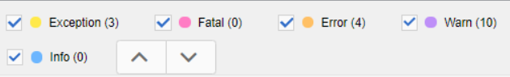

# Fehlerbehebung bei Veröffentlichungsfehlern

Das Veröffentlichen einer Karte ist normalerweise einfach. Öffnen Sie die Karte, wählen Sie eine Ausgabevorgabe aus und generieren Sie die Ausgabe! Wenn jedoch eine Zuordnung oder deren Themen Fehler enthalten, kann die Generierung der Ausgabe fehlschlagen. In diesem Fall ist es wichtig zu wissen, wie eine Fehlerbehebung durchgeführt werden kann.

>[!VIDEO](https://video.tv.adobe.com/v/338990?quality=12&learn=on)

## Vorbereitung der Übung

Hier können Sie Beispieldateien für die Übung herunterladen.

[Übung-Download](assets/exercises/publishing-basic-to-advanced.zip)

## Häufige Ursachen für Veröffentlichungsfehler

In den Quellinhalt können Fehler eingefügt werden. Beispiel:

* Falsch benannter Dateipfadverweis

* Falsch benannter Ordner

* Fehlende Grafik oder Datei

* Falsch konfigurierte Inhaltsreferenz

* Beschädigte Querverweise

* Fehler in den Werten für ein Attribut (z. B. eine Zeichenfolge anstelle einer Zahl)

* Falsche Einrichtung von Komponenten, die von [!DNL AEM Guides]

## Auswirkungen von Fehlern

Ein Fehler kann geringfügig sein und dazu führen, dass eine Datei nicht erfolgreich gepackt wurde, oder dass sie so schwerwiegend ist, dass die Ausgabe vollständig fehlschlägt. Auf der Registerkarte &quot;Ausgaben&quot;werden farbcodierte Symbole angezeigt, die Erfolg, Fehler oder Fehler im Zusammenhang mit der Ausgabegenerierung anzeigen.

## Fehlerprotokolle öffnen und überprüfen

Die erstellte Protokolldatei kann zur Überprüfung geöffnet werden.

1. Im **Ausgaben** klicken Sie auf die **Datum/Uhrzeit unter Generiert am.**

   

2. Scrollen Sie durch das Fehlerprotokoll.

## Ein- und Ausblenden von Fehlertypen

Das Fehlerprotokoll zeigt jeden Fehlertyp in einer eindeutigen Farbe an.

1. **Auswählen** oder **Auswahl aufheben** alle Fehlertypen, um die Hervorhebung ein- oder auszublenden.

2. Navigieren Sie mithilfe der **next** oder **previous** Schaltflächen (Pfeile).

## Beheben von Fehlern

Je nach Fehlertyp kann die Auflösung einfach oder komplex sein. Sie kann von einem Autor im XML-Editor ausgefüllt werden oder erfordern, dass ein Administrator mit [!DNL AEM Guides]. Die spezifischen Korrekturen hängen vom Fehler, den Auswirkungen und Ihren Organisations-Workflows ab.

* Falsch benannter Dateipfadverweis

       Autoren können die Pfadreferenz im Quelldokument aktualisieren.
       
   
* Falsch benannter Ordner

       Autoren können den Ordnernamen aktualisieren oder Dateien nach Bedarf verschieben.
       
   
* Fehlende Grafik oder Datei

       Autoren können eine fehlende Grafik/Datei hochladen, eine Grafik/Datei umbenennen oder eine Grafik/Datei verschieben
       
   
* Falsch konfigurierte Inhaltsreferenz

       Autoren können den Speicherort des referenzierten Inhalts korrigieren oder den Pfad zum Inhaltsverweis ändern.
       
   
* Beschädigte Querverweise

       Autoren können den Speicherort korrigieren, zu dem der Querverweis verweist, oder den Namen oder die Eigenschaften der Zieldatei ändern
       
   
* Fehler in den Werten für ein Attribut (z. B. eine Zeichenfolge anstelle einer Zahl)

       Autoren können das Attribut auf einen korrekten Wert aktualisieren oder Administratoren können das System aktualisieren, um neue Werte zu unterstützen.
       
   
* Falsche Einrichtung von Komponenten, die von [!DNL AEM Guides]

       Administratoren können die Installation des Systems, seiner Komponenten oder Berechtigungen aktualisieren.
       
   