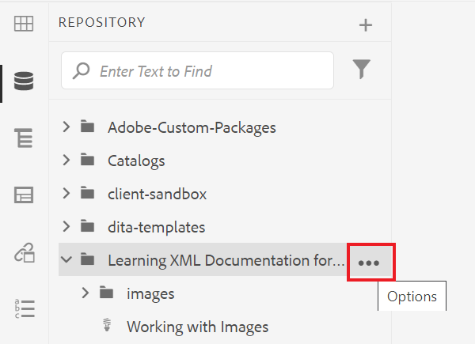

# Arbeiten mit Berichten

Auf der Registerkarte Berichte im Map-Dashboard können Sie fehlerhafte Links, referenzierte und wiederverwendete Inhalte (Conrefs), Querverweise oder andere fehlende Informationen identifizieren und auflösen.

>[!VIDEO](https://video.tv.adobe.com/v/339039?quality=12&learn=on)

## Vorbereitung der Übung

Hier können Sie Beispieldateien für die Übung herunterladen.

[Übung-Download](assets/exercises/working-with-reports.zip)

## Hochladen von Assets

1. Wählen Sie in der Repository-Ansicht das Auslassungssymbol in Ihrem Hauptordner aus, um das Menü &quot;Optionen&quot;zu öffnen.

   

2. Auswählen **[!UICONTROL Hochladen von Assets]**.

   

3. Wählen Sie die Dateien aus, die Sie in den Ordner hochladen möchten, und wählen Sie **Hochladen**.

Die DITA-Dateien werden geöffnet und Sie sollten sie auf Probleme mit fehlendem Inhalt, Conrefs oder Querverweisen überprüfen.

## Landkarte erstellen

1. Wählen Sie das Symbol Auslassungspunkte in Ihrem Hauptordner aus, um das Menü Optionen zu öffnen.

   

2. Auswählen **Erstellen > Karte**.

   

   Das Dialogfeld Neue Karte erstellen wird angezeigt.

3. Wählen Sie im Feld Vorlage die Option **Lesezeichen** (oder **Zuordnung** basierend auf dem Inhaltstyp, den Sie erstellen) aus dem Dropdown-Menü und geben Sie Ihrer Karte einen Titel.

4. Wählen Sie **Erstellen** aus.

Ihre Zuordnung wird erstellt und die linke Leiste ändert sich automatisch von der Ansicht &quot;Repository&quot;in die Ansicht &quot;Map&quot;.

## Zuordnungskomponenten einfügen

1. Wählen Sie in der linken Leiste das Stiftsymbol aus.
Dies ist das Symbol Bearbeiten und ermöglicht das Öffnen der Karte im Editor.

   

2. Wechseln Sie zurück zur Ansicht &quot;Repository&quot;, indem Sie auf das Symbol &quot;Repository&quot;klicken.

   

3. Fügen Sie der Zuordnung ein Thema hinzu, indem Sie es aus dem Repository in die Zuordnung im Editor ziehen und ablegen.
Die Zeilenanzeige zeigt an, wo Ihr Thema platziert wird.

4. Fügen Sie nach Bedarf weitere Themen hinzu.

5. Wenn Sie fertig sind, wählen Sie **Als neue Version speichern**

   

6. Im *Kommentare für neue Version* ein, geben Sie einen beschreibenden Kommentar ein.

7. Wählen Sie **Speichern** aus.

## Generieren einer AEM Site-Ausgabe

1. Wählen Sie im Repository das Auslassungssymbol auf Ihrer Karte aus, um das Menü &quot;Optionen&quot;zu öffnen, und klicken Sie dann auf **Öffnen Sie das Map Dashboard.**

   

   Das Zuordnungs-Dashboard wird in einer anderen Registerkarte geöffnet.
2. Wählen Sie auf der Registerkarte Ausgabevorgaben die Option **AEM Site**.

   

3. Auswählen **Erzeugen**.

4. Navigieren Sie zur Seite Ausgaben , um den Status Ihrer generierten Ausgaben anzuzeigen.
Wenn Fehler auftreten, kann auf der Registerkarte &quot;Ausgaben&quot;unter der Spalte &quot;Erzeugungseinstellung&quot;ein orangefarbener Kreis anstelle der grünen Spalte angezeigt werden, der angibt, dass die Generierung abgeschlossen ist.

5. Wählen Sie den Link unter der Spalte Generierungseinstellung aus, um die generierte Ausgabe zu öffnen.
Überprüfen Sie Ihre Ausgabe auf fehlende Inhalte.

## Die Registerkarte Berichte

Auf der Registerkarte Berichte werden eine Themenübersicht sowie eine Tabelle mit Themeninformationen und den Problemen in Ihrer Zuordnung angezeigt.

Idealerweise sollten Sie nach dem Import von Inhalten immer die Berichte auf eine Zuordnung überprüfen.

Die Spalte &quot;Fehlende Elemente&quot;gibt die Anzahl der fehlenden Bilder und beschädigten Conrefs an. Sie können die **Bleistift** -Symbol, um das Thema im Editor zu öffnen.

## Beheben fehlender Bilder

Wenn in Ihren Dateien Bilder fehlen, kann dies häufig dazu führen, dass Inhalte hochgeladen wurden, Bilder jedoch nicht. Falls ja, beheben Sie die fehlenden Bildprobleme, indem Sie Bilder in einen bestimmten Ordner hochladen, der dem Pfad und den Dateinamen entspricht, die von den Dateien erwartet werden.

1. In *Repository-Ansicht* Wählen Sie das Symbol Auslassungszeichen in Ihrem Ordner Bilder aus, um das Menü Optionen zu öffnen.

   

2. Auswählen **[!UICONTROL Hochladen von Assets]** und wählen Sie die fehlenden Bilder aus.

3. Wählen Sie **Hochladen**.

Die fehlenden Bilder wurden hochgeladen. Jetzt werden diese Bilder in einer neu generierten AEM Site-Ausgabe angezeigt und im Tab Berichte werden keine fehlenden Bildfehler mehr angezeigt.

## Auflösen defekter Conrefs

Wenn Inhalte, auf die an anderer Stelle verwiesen wird (eine conref), für eine Datei in einem anderen Ordner verlinkt sind (z. B. einer mit dem Namen &quot;Wiederverwendung&quot;). und der Inhalt nicht hochgeladen wurde, muss ein Fehler behoben sein. Sie müssen beispielsweise einen Unterordner mit dem Namen &quot;Wiederverwenden&quot;erstellen und die fehlende Datei in &quot;Wiederverwenden&quot;hochladen.

### Hochladen eines Assets mit der [!UICONTROL Assets] Benutzeroberfläche

Zusätzlich zu den [!UICONTROL Hochladen von Assets] -Option können Sie Assets hochladen, indem Sie sie per Drag-and-Drop in die Assets-Benutzeroberfläche ziehen.

1. Wählen Sie in der Repository-Ansicht das Auslassungssymbol in Ihrem Ordner zur Wiederverwendung aus, um das Menü Optionen zu öffnen.

   

2. Auswählen **Anzeigen in der Assets-Benutzeroberfläche**.

   

3. Ziehen Sie die Datei in den Ordner.
Die Datei wird hochgeladen und der conref -Fehler wurde behoben.

Alle Fehler wurden nun behoben. Die Seite Berichte zeigt an, dass keine Fehler mehr auftreten. Die Generierung einer AEM Site führt zu einer vollständigen Ausgabe ohne fehlende Komponenten.
