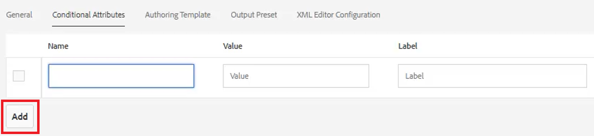
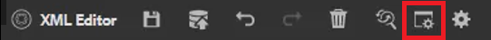
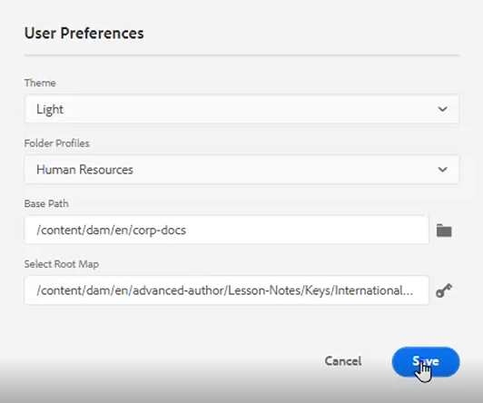
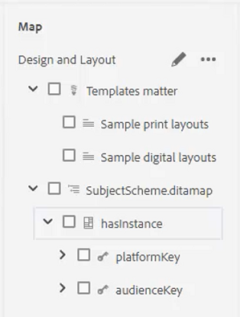
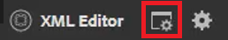
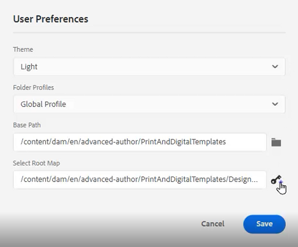

# Bedingungen

In DITA werden Bedingungen häufig durch Attribute wie Produkt, Plattform und Zielgruppe gesteuert. Diesen können auch bestimmte Werte zugewiesen werden. Benutzer können all dies über Ordnerprofile steuern.

Beispieldateien, die Sie für diese Lektion verwenden können, finden Sie in der Datei . [conditions.zip](assets/conditions.zip).

>[!VIDEO](https://video.tv.adobe.com/v/342755?quality=12&learn=on)

## Zuweisen von Bedingungen zu einem Ordnerprofil

1. Wählen Sie die **Ordnerprofile** Kachel.

1. Klicken [!UICONTROL **Bedingte Attribute**].

1. Klicken [!UICONTROL **Bearbeiten**] in der oberen linken Ecke des Profils.

1. Klicken Sie auf [!UICONTROL **Hinzufügen**].

   

1. Füllen Sie die erforderlichen Felder aus.

   - Der Name sollte einem Attribut entsprechen, das für die Profilerstellung verwendet wird.

   - Der Wert ist der genaue Eintrag, der in der DITA-Codequelle verwendet wird.

   - Die Bezeichnung ist das Wort, das der Benutzer sehen wird, der Attribute eingibt.

1. Klicken Sie auf [!UICONTROL **Speichern**].

>[!NOTE]
>
>HINWEIS: Die Konfiguration eines globalen Profils kann eine frühe und effiziente Möglichkeit sein, die Verwendung von Attributen und Werten zu steuern, um einem konsistenten Stilhandbuch zu folgen.

## Zuweisen von Attributen zu Elementen

Wenn einem Konzept kein benutzerdefiniertes Ordnerprofil zugewiesen wurde, können Sie bestimmten Elementen, wie z. B. Absätzen, Attribute zuweisen.

1. Aus dem **Repository-Ansicht** klicken Sie auf das Element, mit dem Sie arbeiten möchten, um es auszuwählen.

1. Im **Inhaltseigenschaften** auf das [!UICONTROL **Attribut**] Dropdown-Liste.

1. Wählen Sie das Attribut aus, das Sie zuweisen möchten.

1. Hinzufügen einer **Wert**.

Die Zuordnung von Attribut und Wert wird nun dem ausgewählten Element zugewiesen.

## Zuweisen von Attribut- und Wertpaaren mithilfe von Bedingungen

Das Bedienfeld &quot;Bedingungen&quot;ermöglicht die kontrollierte Zuweisung von Attribut- und Wertpaaren.

1. Ändern Sie die **Benutzereinstellungen**.

   a. Klicken Sie auf das Symbol Benutzereinstellungen .

   

   b. Füllen Sie die erforderlichen Felder in der **Benutzereinstellungen** angezeigt. Beispiel:

   

   c. Klicken Sie auf [!UICONTROL **Speichern**].

1. Erweitern Sie im Bedienfeld Bedingungen die Dropdown-Listen für Zielgruppe und Plattform . Beachten Sie, dass die verfügbaren Bedingungen ordnerprofilspezifisch sind.

1. Ziehen Sie eine Bedingung auf das gewünschte Element, um sie zuzuweisen.

## Zuweisen eines Betreffschemas

Themenschema-Karten sind eine spezielle Form der Ditamap und werden durch eine Karte referenziert. Betreffschemata dienen zur Definition von Taxonomien. Sie ermöglichen die Kontrolle über die verfügbaren Werte.

1. Navigieren Sie zum **Repository-Ansicht**.

1. Wählen Sie eine Karte aus, die auf die Ditamap zum Themenschema verweist. In diesem Beispiel wird die Zuordnung mit dem Namen _Design und Layout_.

   

1. Benutzereinstellungen konfigurieren.

   a. Klicken Sie auf [!UICONTROL **Benutzereinstellungen**] Symbol.

   

   b. Füllen Sie die Felder im **Benutzereinstellungen** angezeigt.

   c. Klicken Sie auf das Ordnersymbol neben dem Feld Basispfad , um den Pfad zur gewünschten Datei auszuwählen.

   d. Klicken [!UICONTROL **Auswählen**].

   e. Klicken Sie auf das Schlüsselsymbol neben dem **Stammkarte** -Feld, um einen Pfad einzugeben.

   >[!IMPORTANT]
   >
   >Wichtig: Die ausgewählte Stammkarte muss die Karte sein, die das Themenschema enthält.

   

   f. Schränken Sie die angezeigten Assets ein, indem Sie die Ordner auswählen, die Sie verwenden möchten.

   g. Klicken [!UICONTROL **Auswählen**].

   h. Klicken [!UICONTROL **Speichern**].

Das Themenschema wurde nun zugewiesen.

## Anzeigen des Betreffsystems im Bedienfeld &quot;Bedingungen&quot;

1. Navigieren Sie zu **Editor-Einstellungen**.

1. Wählen Sie die **Bedingungen** Registerkarte.

1. Aktivieren Sie das Kontrollkästchen **Schema des Betreffs im Bedienfeld &quot;Bedingungen&quot;anzeigen**
