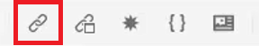
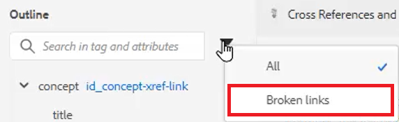

# Querverweise und Links

Der XML-Editor und DITA bieten eine leistungsstarke Möglichkeit, Themen miteinander zu verknüpfen. Es ist wichtig, Ihre Inhaltsverweise effektiv zu verwalten. Dazu gehört auch die Arbeit mit eindeutigen ID-Werten.

Beispieldateien, die Sie für diese Lektion verwenden können, finden Sie in der Datei .
[crossreferencesandlinks.zip](assets/crossreferencesandlinks.zip)

>[!VIDEO](https://video.tv.adobe.com/v/342764)

## Erstellen eines Querverweises auf ein externes Thema

Es ist möglich, einen externen Querverweis zu erstellen, indem Sie ein Thema aus dem Repository in eine geöffnete Datei ziehen und dort ablegen. Um jedoch fehlerhafte Querverweise zu vermeiden, muss zunächst eine ID für einen Wert definiert werden, der mit dem übergeordneten Element verknüpft ist. Dies ist eine einfache Möglichkeit, einen Querverweis zu erstellen und dabei sicherzustellen, dass IDs korrekt zugewiesen sind.

1. Öffnen Sie eine Datei, in die Sie einen externen Querverweis einfügen möchten.

2. Weisen Sie dem Element, auf das verwiesen werden soll, eine ID zu.

   a. Klicken Sie in das Element.

   b. Wählen Sie im Bereich &quot;Inhaltseigenschaften&quot;die Option **ID** aus der Dropdown-Liste Attribut .

   c. Geben Sie einen logischen Namen in das Feld Wert ein.

   d. Element und Wert anzeigen in **Gliederungsansicht** falls gewünscht.

3. **Speichern** das Thema, um sicherzustellen, dass das Repository über die aktualisierte ID verfügt.

4. Klicken Sie auf [!UICONTROL **Referenz**] in der oberen Symbolleiste.

   

5. Aus dem **Inhaltsreferenz** wählen Sie die ID und die Elementpaarung aus, die Sie als Querverweis einfügen möchten.

6. Klicken Sie auf [!UICONTROL **Auswählen**].

Der Querverweis wurde zum Thema hinzugefügt.

## Link zu einer Website

Sie können einen Link zu einer Website innerhalb eines beliebigen Themas einfügen. Weitere Informationen finden Sie im Video AEM Guides Course 1 unter Verknüpfen mit Websites .

## Beschädigte Links anzeigen

Einige Änderungen können zu fehlerhaften Querverweisen führen. Dazu gehören das Löschen eines Themas, das Neuorganisieren eines Abschnitts, der einen Querverweis enthält, oder das Ändern einer ID nach dem Einfügen des Querverweises. Beachten Sie, dass ein Beispielthema _crossreferencesandlinks.zip_ wird mit dieser Lektion bereitgestellt, die dazu führt, dass mehrere der Stichpunkt-Querverweise auf internen Inhalt beschädigt werden.

1. Navigieren Sie zum **Gliederungsansicht** im linken Bereich.

2. Klicken Sie auf [!UICONTROL **Filter**] Symbol.

3. Auswählen **Fehlerhafte Links**.

   

Beschädigte Links werden als anklickbare Objekte angezeigt. Sie können sie in rotem Text im Thema identifizieren.
