# Konfiguration des XML-Editors

Wenn Sie in einer restriktiven Umgebung arbeiten, können Sie festlegen, welche Funktionen Ihre Autoren sehen können, indem Sie die Editor-Konfiguration in einem bestimmten Ordnerprofil anpassen. Durch die Anwendung dieses Ordnerprofils kann sich das Erscheinungsbild des Editors selbst, die CSS-Vorlagen, die verfügbaren Snippets und die Beschriftungen der Inhaltsversion ändern.

Beispieldateien, die Sie für diese Lektion verwenden können, finden Sie in der Datei . [xmleditorconfiguration.zip](assets/xmleditorconfiguration.zip).

>[!VIDEO](https://video.tv.adobe.com/v/342762?quality=12&learn=on)

## Anpassen der standardmäßigen Konfiguration der Editor-Benutzeroberfläche

Sie können die standardmäßige Benutzeroberflächenkonfiguration immer auf Ihr lokales System herunterladen, Änderungen daran im Texteditor Ihrer Wahl vornehmen und sie erneut hochladen.

1. Klicken Sie im Navigationsbildschirm auf das [!UICONTROL **Instrumente**] Symbol.

   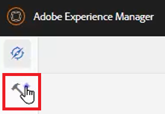

2. Auswählen **Handbücher** im linken Bereich.

3. Klicken Sie auf [!UICONTROL **Ordnerprofile**] Kachel.

   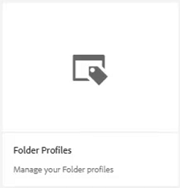

4. Wählen Sie ein Ordnerprofil aus.

5. Klicken Sie auf [!UICONTROL **Konfiguration des XML-Editors**] Registerkarte.

6. Klicken [!UICONTROL **Download**] Standard.

   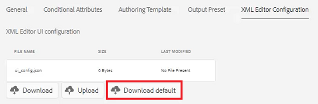

Sie können den Inhalt jetzt in einem Texteditor öffnen und ändern. Die _Installation und Konfiguration AEM Handbücher_ Das Handbuch enthält Beispiele zum Entfernen, Anpassen oder Hinzufügen von Funktionen zur UI-Konfiguration.

## Hochladen der geänderten Konfiguration der XML-Editor-Benutzeroberfläche

Nach der Anpassung der Benutzeroberflächenkonfiguration können Sie sie hochladen. Beachten Sie, dass eine Beispielkonfigurationsdatei _ui-config-restricted-editor.json_ enthält einen Satz unterstützender Themen für diese Lektion.

1. Klicken Sie im Ordnerprofil auf das [!UICONTROL **Konfiguration des XML-Editors**] Registerkarte.

2. Klicken Sie unter &quot;Konfiguration der XML-Editor-Benutzeroberfläche&quot;auf [!UICONTROL **Hochladen**].

   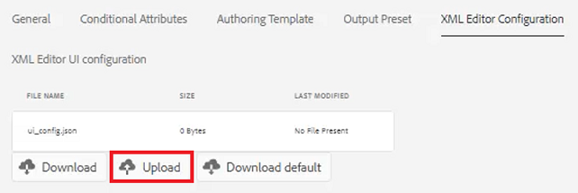

3. Doppelklicken Sie auf die Datei für Ihre geänderte Benutzeroberflächenkonfiguration oder wie hier gezeigt, auf die bereitgestellte Beispieldatei.

   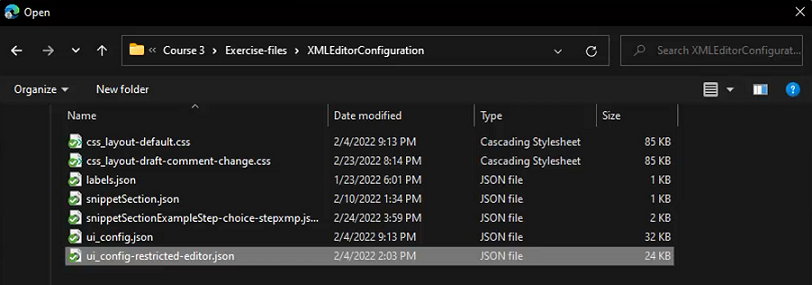

4. Klicken [!UICONTROL **Speichern**] in der oberen linken Ecke des Bildschirms.

Sie haben die geänderte Benutzeroberflächenkonfiguration erfolgreich hochgeladen.

## Anpassen des Layouts der CSS-Vorlage

Wie bei der Benutzeroberflächenkonfiguration können Sie auch das CSS-Vorlagenlayout herunterladen. Sie können sie in einem Texteditor öffnen und vor dem Hochladen Änderungen vornehmen, um das Erscheinungsbild Ihres Themas anzupassen.

1. Klicken Sie im Navigationsbildschirm auf das [!UICONTROL **Instrumente**] Symbol.

   

2. Auswählen **Handbücher** im linken Bereich.

3. Klicken Sie auf [!UICONTROL **Ordnerprofile**] Kachel.

   

4. Wählen Sie ein Ordnerprofil aus.

5. Klicken Sie auf [!UICONTROL **Konfiguration des XML-Editors**] Registerkarte.

6. Klicken Sie unter &quot;Layout der CSS-Vorlage&quot;auf [!UICONTROL **Download**].

   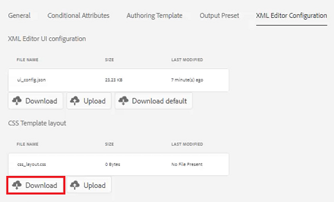

Jetzt können Sie den CSS-Inhalt in einem Texteditor ändern und speichern.

## Hochladen des geänderten CSS-Vorlagenlayouts

Nach der Anpassung des Layouts der CSS-Vorlage können Sie sie hochladen. Beachten Sie, dass eine Beispieldatei _css-layout-ONLY-draft-comment-change.css_ enthält einen Satz unterstützender Themen für diese Lektion. Diese Datei enthält nur die Entwurfskommentänderung, während _css-layout-draft-comment-change.css_ ist die gesamte Datei, die nur zu Test- oder Prüfungszwecken zur Verfügung steht.

1. Klicken Sie im Ordnerprofil auf das [!UICONTROL **Konfiguration des XML-Editors**] Registerkarte.

2. Klicken Sie unter &quot;Layout der CSS-Vorlage&quot;auf [!UICONTROL **Hochladen**].

   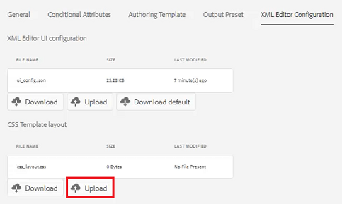

3. Doppelklicken Sie auf die Datei für Ihr eigenes benutzerdefiniertes CSS-Layout oder die hier angezeigte Beispieldatei.

   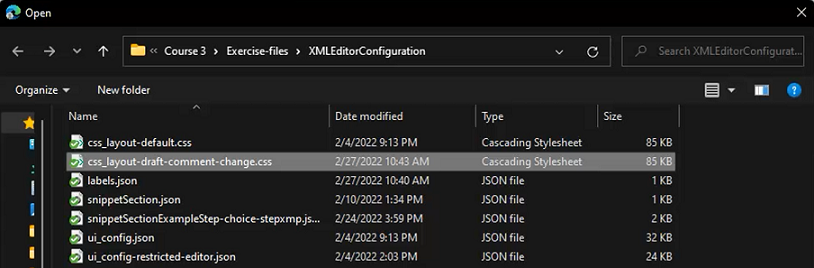

4. Klicken [!UICONTROL **Speichern**] in der oberen linken Ecke des Bildschirms.
Sie haben das angepasste CSS-Vorlagenlayout erfolgreich hochgeladen.

## Bearbeiten von XML-Editor-Snippets

Snippets sind wiederverwendbare Inhaltselemente, die für ein Produkt oder eine Gruppe spezifisch sein können. Beachten Sie, dass Beispielsegmente mit den Support-Dateien für diese Lektion bereitgestellt werden.

1. Klicken Sie im Navigationsbildschirm auf das [!UICONTROL **Instrumente**] Symbol.

   

2. Auswählen **Handbücher** im linken Bereich.

3. Klicken Sie auf [!UICONTROL **Ordnerprofile**] Kachel.

   

4. Wählen Sie ein Ordnerprofil aus.

5. Klicken Sie auf [!UICONTROL **Konfiguration des XML-Editors**] Registerkarte.

6. Klicken Sie unter &quot;XML Editor Snippets&quot;auf **Hochladen**.

   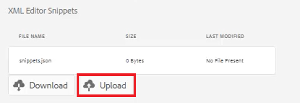

7. Wählen Sie Ihre eigenen Snippets oder verwenden Sie die bereitgestellten Beispiele.

   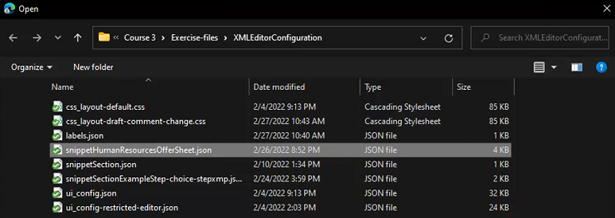

8. Klicken [!UICONTROL **Speichern**] in der oberen linken Ecke des Bildschirms.

Sie haben dem Editor erfolgreich neue Snippets hinzugefügt.

## Anpassen der Beschriftungen der XML-Inhaltsversion

Autoren können standardmäßig Titel ihrer Wahl erstellen und sie mit Themendateien verknüpfen. Dies kann zu unterschiedlichen Variationen auf derselben Bezeichnung führen. Um inkonsistente Beschriftungen zu vermeiden, können Sie auch aus Listen mit vordefinierten Beschriftungen wählen.

1. Klicken Sie im Navigationsbildschirm auf das [!UICONTROL **Instrumente**] Symbol.

   

2. Auswählen **Handbücher** im linken Bereich.

3. Klicken Sie auf [!UICONTROL **Ordnerprofile**] Kachel.

   

4. Wählen Sie ein Ordnerprofil aus.

5. Klicken Sie auf [!UICONTROL **Konfiguration des XML-Editors**] Registerkarte.

6. Klicken Sie unter &quot;Beschriftungen der XML-Inhaltsversion&quot;auf [!UICONTROL **Download**].

   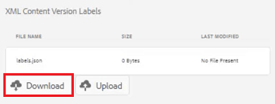

Jetzt können Sie die Beschriftungen nach Bedarf anpassen.

## Hochladen von XML-Inhaltsversionsbeschriftungen

Nachdem Sie die Beschriftungen heruntergeladen und geändert haben, können Sie das Thema &quot;XML Content Version Label&quot;hochladen. Sie können die Beispieldatei verwenden _label.json_, das mit den für diese Lektion unterstützten Themen bereitgestellt wird.

1. Klicken Sie im Ordnerprofil auf das [!UICONTROL **Konfiguration des XML-Editors**] Registerkarte.

2. Klicken Sie unter &quot;Beschriftungen der XML-Inhaltsversion&quot;auf [!UICONTROL **Hochladen**].

   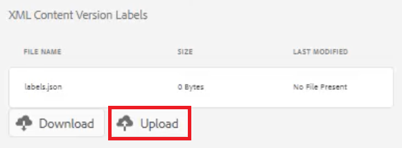

3. Doppelklicken Sie auf die Datei für Ihre eigenen benutzerdefinierten Beschriftungen oder die hier angezeigte Beispieldatei.

   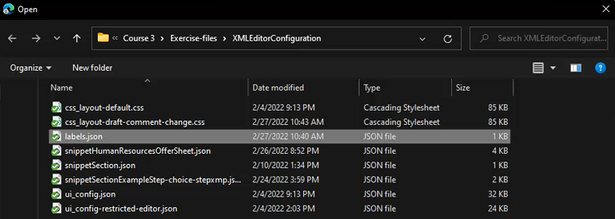

4. Klicken [!UICONTROL **Speichern**] in der oberen linken Ecke des Bildschirms.

Sie haben erfolgreich benutzerdefinierte XML-Inhaltsversionsbeschriftungen hochgeladen.
