# Ordnerprofile

AEM bietet schnellen Zugriff auf Konfigurationswerkzeuge. Durch die Anpassung von Ordnerprofilen können verschiedene Abteilungen oder Produkte über eindeutige Vorlagen, Autorenumgebungen, bedingte Attributprofile, Snippets oder sogar Web-Editor-Konfigurationen verfügen.

Beispieldateien, die Sie für diese Lektion verwenden können, finden Sie in der Datei . [folderprofiles.zip](assets/folderprofiles.zip).

>[!VIDEO](https://video.tv.adobe.com/v/342758?quality=12&learn=on)

## Auf Ordnerprofile zugreifen

Konfigurationen werden über das Symbol Ordnerprofile verwaltet.

1. Klicken Sie im Navigationsbildschirm auf das [!UICONTROL **Instrumente**] Symbol.

   

1. Auswählen **Handbücher** im linken Bereich.

1. Klicken Sie auf [!UICONTROL **Ordnerprofile**] Kachel.

   

1. Wählen Sie das gewünschte Profil aus. Wählen Sie beispielsweise **Globales Profil**, das Standardprofil.

   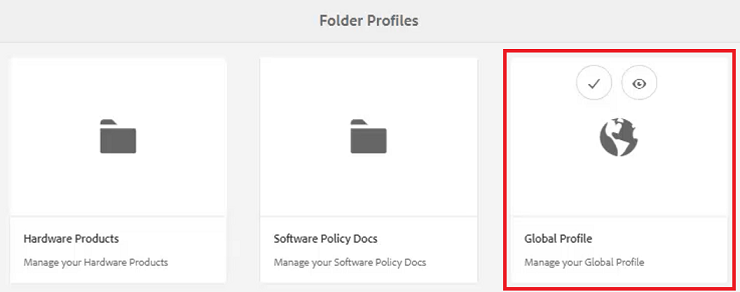

## Bedingte Attribute im globalen Profil bearbeiten

Nachdem Sie auf das globale Profil zugegriffen haben, können Sie dessen Konfiguration bearbeiten. Sofern nicht anders angegeben, werden die Einstellungen für das globale Profil auf alle Benutzer angewendet.

1. Wählen Sie im globalen Profil die **Bedingte Attribute** Registerkarte.

1. Klicken [!UICONTROL **Bearbeiten**] in der oberen linken Ecke des Bildschirms.

   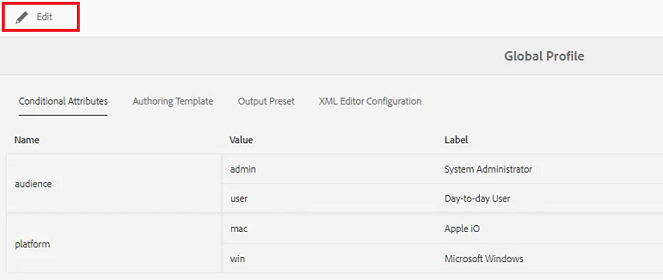

1. Klicken Sie auf [!UICONTROL **Hinzufügen**].

1. Füllen Sie die **Name**, **Wert** und **Titel** -Felder für die neue Bedingung.

   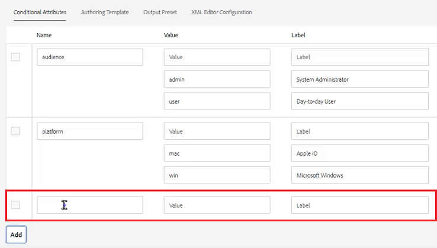

1. Klicken [!UICONTROL **Speichern**] oben links im Bildschirm.
Die neue Bedingung ist jetzt für alle Benutzer verfügbar. Sie können sie im Bereich Inhaltseigenschaften auswählen und sie nach Bedarf auf Inhalte anwenden.

## Neues Ordnerprofil erstellen

Zusätzlich zum standardmäßigen globalen Profil können Sie auch eigene benutzerdefinierte Profile erstellen.

1. Klicken Sie im Navigationsbildschirm auf das [!UICONTROL **Instrumente**] Symbol.

   

1. Auswählen **Handbücher** im linken Bereich.

1. Klicken Sie auf [!UICONTROL **Ordnerprofile**] Kachel.

   

1. Klicken Sie auf [!UICONTROL **Erstellen**].

1. Im Dialogfeld Ordnerprofil erstellen .

   a. Benennen Sie das Profil.

   b. Geben Sie einen Pfad an.

   c. Klicken Sie auf [!UICONTROL **Erstellen**].

   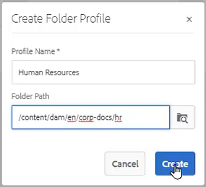

Eine Kachel mit dem neuen Profilnamen wird auf der Seite Ordnerprofile angezeigt.

## Hinzufügen administrativer Benutzer über die Registerkarte &quot;Allgemein&quot;

Administrative Benutzer sind berechtigt, die bedingten Attribute, die Bearbeitungsvorlage und die Ausgabevorgaben für das Ordnerprofil zu aktualisieren.

1. Klicken Sie auf die Kachel, um das gewünschte Ordnerprofil zu öffnen.

   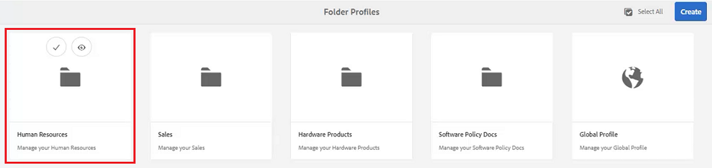

1. Wählen Sie die **Allgemein** Registerkarte.

1. Klicken [!UICONTROL **Bearbeiten**] oben links im Bildschirm.

1. Wählen Sie unter &quot;Admin Users&quot;einen Benutzer aus der Dropdown-Liste aus oder geben Sie den Namen eines Benutzers ein.

1. Klicken Sie auf [!UICONTROL **Hinzufügen**].

   Sie können bei Bedarf mehrere Admin-Benutzer hinzufügen.

   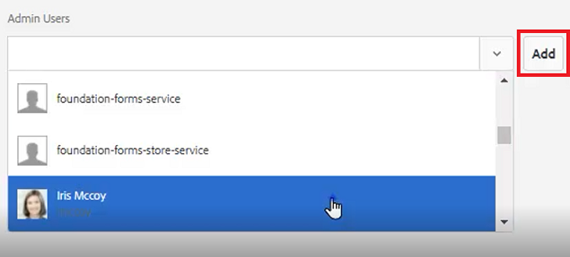

1. Klicken [!UICONTROL **Speichern**] in der oberen rechten Ecke des Bildschirms, wenn alle Benutzer hinzugefügt wurden.

Diesem Profil werden jetzt Benutzer mit Administratorrechten zugewiesen.

## Fügen Sie auf der Registerkarte Bedingte Attribute eine neue Zielgruppe hinzu

Nachdem Sie auf das globale Profil zugegriffen haben, können Sie dessen Konfiguration bearbeiten. Sofern nicht anders angegeben, werden die Einstellungen für das globale Profil auf alle Benutzer angewendet.

1. Wählen Sie im gewünschten Ordnerprofil die **Bedingte Attribute** Registerkarte.

1. Klicken [!UICONTROL **Bearbeiten**] in der oberen linken Ecke des Bildschirms.

   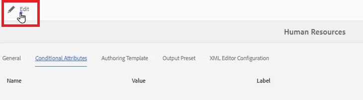

1. Klicken Sie auf [!UICONTROL **Hinzufügen**].

1. Füllen Sie die **Name**, **Wert** und **Titel** -Felder für die neue Bedingung.

   Klicken Sie auf [!UICONTROL **Plus**] Mit sign können Sie zusätzliche Wert- und Titelpaare für das benannte Attribut hinzufügen.

   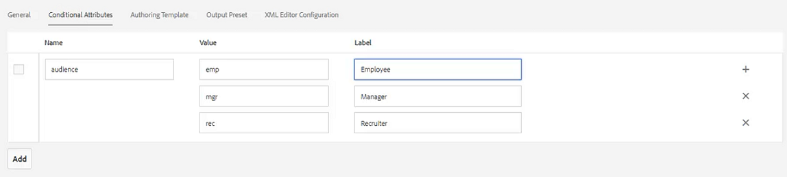

1. Klicken [!UICONTROL **Speichern**] oben links im Bildschirm.

Dieses Profil wurde um die neuen bedingten Attribute erweitert.

## Wählen Sie eine Vorlage und eine Zuordnung auf der Registerkarte Authoring-Vorlagen .

AEM Guides enthalten vordefinierte Authoring-Vorlagen und -Maps. Sie können sie auf bestimmte Autoren beschränken. Standardmäßig werden die Vorlagen im Ordner &quot;Assets&quot;in einem Ordner mit DITA-Vorlagen gespeichert.

1. Wählen Sie im gewünschten Ordnerprofil die Registerkarte Authoring-Vorlagen aus.

1. Klicken Sie in der oberen linken Ecke des Bildschirms auf Bearbeiten .

1. Fügen Sie eine Zuordnungsvorlage hinzu.

   a. Aus dem **Zuordnungsvorlagen** eine Option aus den verfügbaren Karten.

   b. Klicken [!UICONTROL **Hinzufügen**].

   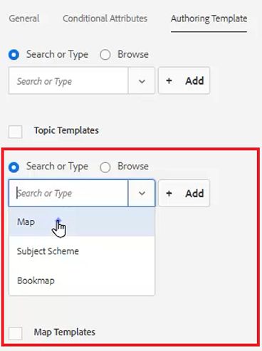

1. Fügen Sie eine Themenvorlage hinzu.

   a. Aus dem **Themenvorlagen** eine Option aus den verfügbaren Vorlagen aus.

   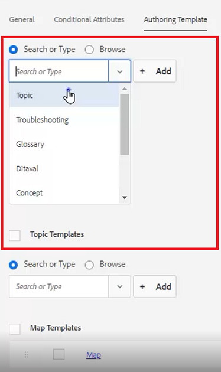

1. Klicken Sie auf [!UICONTROL **Hinzufügen**].

1. Fügen Sie nach Bedarf weitere Themenvorlagen hinzu.

1. Klicken Sie abschließend auf [!UICONTROL **Speichern**] oben links im Bildschirm.

Diesem Profil wurden die neuen Authoring-Vorlagen hinzugefügt.

## Löschen nicht erforderlicher Vorgaben auf der Registerkarte &quot;Ausgabevorgaben&quot;

Sie können jede Ausgabevorgabe basierend auf dem Ordnerprofil konfigurieren. Ausgabevorgaben, die nicht benötigt werden, sollten entfernt werden.

1. Wählen Sie im gewünschten Ordnerprofil die **Ausgabevorgaben** Registerkarte.

1. Aktivieren Sie im linken Bereich die Kontrollkästchen aller nicht erforderlichen Vorgaben.

   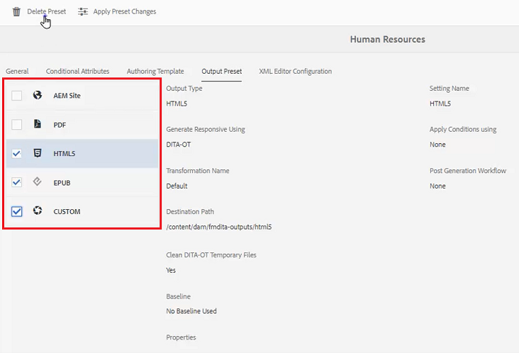

1. Klicken [!UICONTROL **Vorgabe löschen**] in der oberen linken Ecke des Bildschirms.

1. Klicken Sie im Dialogfeld &quot;Vorgabe löschen&quot;auf [!UICONTROL **Löschen**].

   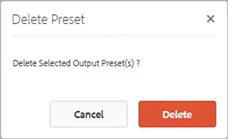

Jetzt werden nur noch die Ausgabevorgaben angezeigt, die verwendet werden.

## Hochladen eines Snippets über die Registerkarte &quot;Konfiguration des XML-Editors&quot;

1. Wählen Sie im gewünschten Ordnerprofil die **Konfiguration des XML-Editors** Registerkarte.

1. Klicken Sie unter &quot;XML Editor Snippets&quot;auf [!UICONTROL **Hochladen**].

   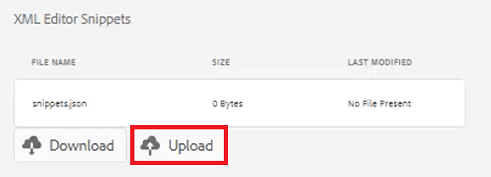

1. Navigieren Sie zu einem zuvor erstellten Snippet.

1. Klicken [!UICONTROL **Öffnen**].

1. Klicken [!UICONTROL **Speichern**] oben links im Bildschirm.

Sie haben die Editor-Konfiguration erfolgreich geändert, um Snippets einzuschließen.

## Geben Sie das Ordnerprofil im Repository an

Im Editor können Sie die Ergebnisse der Änderungen sehen, die Sie an den Ordnerprofilen vorgenommen haben.

1. Navigieren Sie zu **Repository-Ansicht**.

1. Klicken Sie auf den Ordner für den Inhalt, mit dem Sie arbeiten möchten.

1. Klicken Sie auf [!UICONTROL **Benutzereinstellungen**] in der oberen Symbolleiste.

   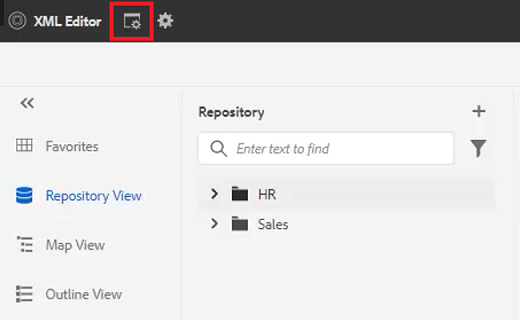

1. Wählen Sie im Dialogfeld Benutzereinstellungen das gewünschte Ordnerprofil aus der Dropdown-Liste aus.

   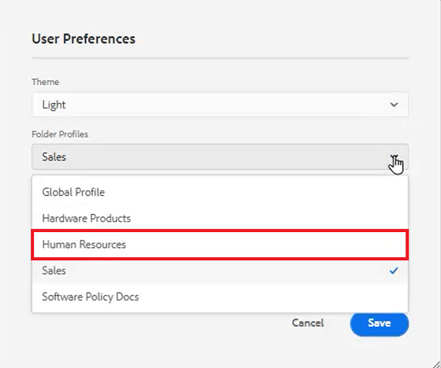

1. Klicken Sie auf [!UICONTROL **Speichern**].

Sie haben das Ordnerprofil auf Ihren Inhalt angewendet. Wenn Sie jetzt ein neues DITA-Thema erstellen, wird eine eingeschränkte Liste von Thementypen angezeigt, die auf dem Ordnerprofil basieren. Die Zielgruppenbedingung enthält die globalen Einstellungen sowie die spezifischen Einstellungen für das Ordnerprofil. Die hochgeladene Snippets-Datei hat einen Satz von standardmäßigen Snippets erstellt, aus denen Sie auswählen können. Das Map Dashboard zeigt die eingeschränkten Ausgabevorgaben an.
