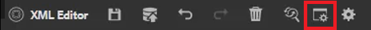
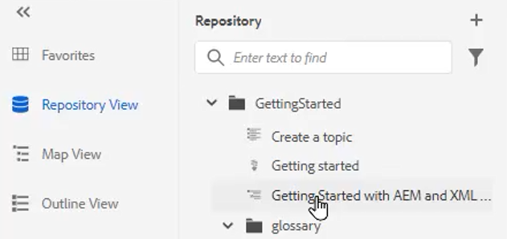
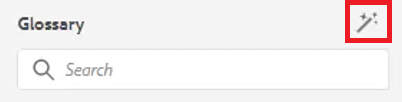

# Glossar

Im Glossar-Bedienfeld kann eine Karte analysiert werden. Sie können eine Glossar-Themendatei erstellen und sie in eine Glossarkarte aufnehmen. Diese Karte kann dann zu anderen Karten hinzugefügt werden. Die Verwendung des Glossars erleichtert es, Informationen konsistent zu formulieren und dem Leser mehr Klarheit zu verschaffen.

Beispieldateien, die Sie für diese Lektion verwenden können, finden Sie in der Datei . [glossary.zip](assets/glossary.zip).

>[!VIDEO](https://video.tv.adobe.com/v/342765)

## Glossareintrag zu einem Thema hinzufügen

1. Navigieren Sie zum **Glossar** Bereich.

2. Ziehen Sie den Eintrag per Drag-and-Drop aus dem **Glossar** an die gewünschte Position in Ihrem Thema.

Wenn die Karte Glossareinträge enthält und ordnungsgemäß konfiguriert ist, können Themen automatisch aktualisiert werden, um ein abgekürztes Formular zu enthalten.

## Festlegen einer Stammzuordnung

Die richtige Stammzuordnung muss ausgewählt sein, damit sie mit einem Glossar ordnungsgemäß funktioniert. Wenn eine Stammzuordnung Glossareinträge findet, werden diese im Glossarbereich angezeigt.

1. Wenn ein Thema geöffnet ist, wählen Sie **Glossar** aus dem linken Bereich.

2. Klicken Sie auf [!UICONTROL **Benutzereinstellungen**] in der oberen Symbolleiste.

   

3. Klicken Sie auf das Schlüsselsymbol, um die richtige Stammzuordnung für die Arbeit mit dem Glossar anzugeben.

4. Klicken Sie auf [!UICONTROL **Auswählen**].

5. Klicken Sie auf [!UICONTROL **Speichern**].

Das Glossarbedienfeld wird automatisch aktualisiert.

## Arbeiten mit dem Glossar

1. Navigieren Sie zum **Repository-Ansicht**.

2. Wählen Sie die vorkonfigurierte Zuordnung für die Verwendung des Glossars aus.

   

3. Wählen Sie die [!UICONTROL **Kartenansicht**].

4. Stellen Sie sicher, dass die Kartenansicht die erforderlichen Themen anzeigt.

## Vorschau eines Glossars

Da es möglich ist, Massenänderungen vorzunehmen, kann es wichtig sein, eine Vorschau eines Glossars anzuzeigen.

1. Auswählen **Glossar** aus dem linken Bereich.

2. Klicken Sie auf das Kontextmenü neben einem Glossar und wählen Sie [!UICONTROL **Vorschau**].

Sowohl die abgekürzte Form als auch die Glossardefinition werden angezeigt.

## Überprüfen der Hotspot-Tool-Einstellungen

Verwenden Sie das Hotspot-Tool, um eine komplette Sammlung von Glossareinträgen aus einer einzelnen Karte zu erstellen. Sie können sogar bestimmte Textbegriffe suchen und in verknüpfte Glossarabkürzungen konvertieren.

1. Wählen Sie im Glossarbedienfeld die [!UICONTROL **Hotspot-Symbol**].

   

2. Klicken Sie auf [!UICONTROL **Glossarschlüssel**] und wählen Sie nur die Schlüssel aus, die Sie anwenden möchten.

3. Klicken Sie auf [!UICONTROL **Themen**] aus, um den Inhalt auszuwählen, der betroffen sein soll.

4. Klicken Sie auf [!UICONTROL **Themen nach Status filtern**] Dropdown, um die konfigurierten Optionen zu überprüfen.

5. Konfigurieren Sie die restlichen Einstellungen nach Bedarf.

6. Klicken Sie abschließend auf [!UICONTROL **Konvertieren**].

Im Glossar-Bedienfeld werden jetzt alle aktualisierten Themen sowie Themen mit Fehlern angezeigt.
