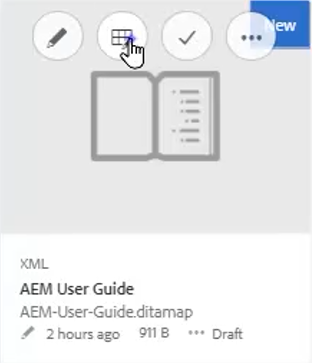
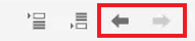
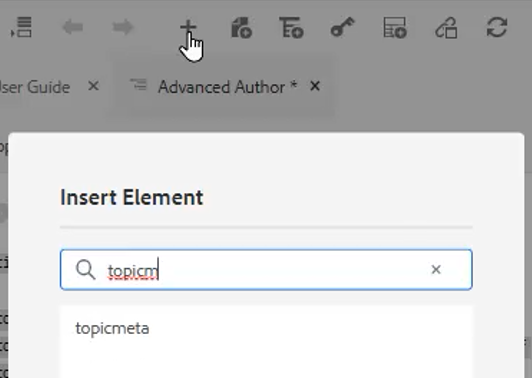
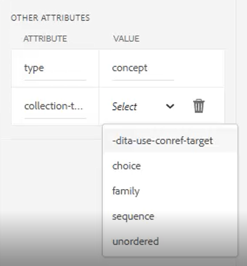

# Karten und Lesekarten

Der Map Editor von Adobe Experience Manager Guides ermöglicht das Erstellen und Bearbeiten von Zuordnungsdateien. Mit dem Map Editor können Sie zwei Arten von Dateien bearbeiten - DITA-Zuordnung und Bookmap. Für unsere Zwecke betrachten sie als weitgehend austauschbare Konzepte.
Der Map Editor ist in zwei Modi verfügbar: den Basic Map Editor und den Advanced Map Editor.

>[!VIDEO](https://video.tv.adobe.com/v/342766?quality=12&learn=on)

## Erstellen einer Karte

AEM Guides bietet zwei vordefinierte Zuordnungsvorlagen - DITA-Zuordnung und Bookmap. Sie können auch eigene Zuordnungsvorlagen erstellen und diese für Ihre Autoren freigeben, um Zuordnungsdateien zu erstellen.

Führen Sie die folgenden Schritte aus, um eine Zuordnungsdatei zu erstellen.

1. Navigieren Sie in der Assets-Benutzeroberfläche zu dem Speicherort, an dem Sie die Zuordnungsdatei erstellen möchten.

1. Klicken [!UICONTROL **Erstellen > DITA Map**].

1. Wählen Sie auf der Blueprint-Seite den Typ der zu verwendenden Zuordnungsvorlagen aus und klicken Sie auf [!UICONTROL **Nächste**].

1. Geben Sie auf der Seite &quot;Eigenschaften&quot;eine **Titel** und **Name** für die Karte.

1. Klicken Sie auf [!UICONTROL **Erstellen**].

## Öffnen einer Karte mit dem erweiterten Map-Editor

1. Im **Assets-Benutzeroberfläche**, wählen Sie die zu bearbeitende Karte aus.

1. Klicken [!UICONTROL **Themen bearbeiten**].

   

Oder

1. Bewegen Sie die Maus über das Kartensymbol.

1. Auswählen **Themen bearbeiten** von **Aktion** Menü.

## Hinzufügen von Inhalten zu einer Karte oder Lesekarte

1. Navigieren Sie zum **Repository-Ansicht**.

1. Ziehen Sie Inhalte aus der Repository-Ansicht an gültige Stellen in der Karte oder der Lesekarte.

Oder

1. Klicken Sie auf eine gültige Position in der Karte oder der Lesekarte.

1. Klicken Sie auf die entsprechende [!UICONTROL **Symbol &quot;Symbolleiste&quot;**] um Kapitel, Themen oder Topicrefs hinzuzufügen.

   

1. Wählen Sie mindestens ein Asset aus, das Sie hinzufügen möchten.

1. Klicken [!UICONTROL **Auswählen**].

### Hervorheben oder Demoten von Elementen in einer Zuordnung

Verwendung **Symbolleistenpfeile** um Kapitel und Topicrefs in einer Karte oder Bookmap zu bewerben oder zu demoten.

1. Wählen Sie ein Element in der Zuordnung aus.

1. Klicken Sie auf [!UICONTROL **Linkspfeil**] ein topicref in ein Kapitel weiterleiten, oder [!UICONTROL **Rechtspfeil**] , um ein Kapitel zu einer topicref zu demotieren.

   

1. Speichern Sie die Karte und verändern Sie sie bei Bedarf.

Oder

1. Ziehen Sie Elemente per Drag-and-Drop in den Arbeitsbereich, um sie neu zu organisieren.

## Hinzufügen von Metadaten zu einer Zuordnung

1. Aus dem **Zuordnungssymbolleiste**, fügen Sie eine topicgroup ein.

   

1. Klicken Sie auf [!UICONTROL **Plus-Symbol**] um Elemente einzufügen.

1. Wählen Sie die einzufügenden Elemente aus.

   

1. Klicken Sie auf [!UICONTROL **Schließen**].

## Hinzufügen einer verknüpften Tabelle zu einer Zuordnung

Eine Reltable kann hinzugefügt werden, nachdem eine Zuordnung strukturiert ist.

1. Klicken Sie auf die Karte, in die Sie die entsprechende Tabelle einfügen möchten.

1. Verwenden Sie die **Symbol &quot;Symbolleiste&quot;** , um die entsprechende Tabelle zur Zuordnung hinzuzufügen.

   

1. Konfigurieren Sie das Dialogfeld.

1. Klicken [!UICONTROL **Einfügen**].

1. Verschieben Sie die erforderlichen Themen per Drag-and-Drop aus dem **Repository** in die Tabelle.

1. Kopieren Sie erforderliche Elemente aus der Zuordnung und fügen Sie sie mithilfe von Standardtastaturkürzeln in die entsprechende Tabelle ein.

## Zuweisen von Attributen zu Topicrefs in einer Zuordnung

1. Markieren Sie eine topicref oder eine verschachtelte Sammlung von topicrefs in der Karte.

1. Wählen Sie unter &quot;Andere Attribute&quot;im Bereich &quot;Inhaltseigenschaften&quot;eine **Attribut** und **Wert.**

   
