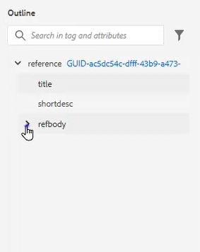
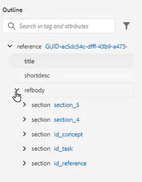
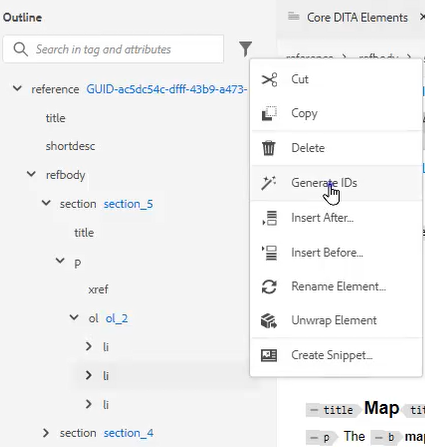
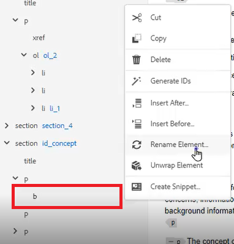
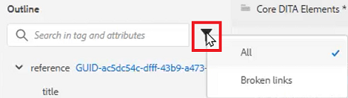
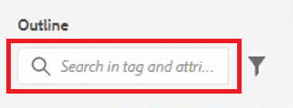

# Gliederungsansicht

Die Gliederungsansicht bietet eine breite Palette an Unterstützung bei der Arbeit mit einem strukturierten Dokument. Erweitern und reduzieren Sie die Ansicht, navigieren Sie zur Struktur, arbeiten Sie mit Attributen (z. B. zum Erstellen einer neuen ID) und organisieren, entpacken und restrukturieren Sie Elemente durch Klicken auf eine Schaltfläche.

>[!VIDEO](https://video.tv.adobe.com/v/342767?quality=12&learn=on)

## Erweitern und Reduzieren der Gliederungsansicht

Elemente können erweitert werden, um untergeordnete Elemente anzuzeigen, oder sie können nach Bedarf ausgeblendet werden.

1. Klicken Sie auf das entsprechende Symbol, um die Linienansicht zu erweitern oder zu reduzieren.

   

   

Die Umrissansicht wechselt von &quot;erweitert&quot;zu &quot;reduziert&quot;.

## Navigieren mit der Konturansicht

1. Klicken Sie auf ein beliebiges Element, um zu diesem Speicherort zu springen.

2. Klicken Sie auf [!UICONTROL **Ellipse**] neben einem Element, um auf die Verknüpfungsoptionen zuzugreifen.

   

## Zuweisen einer ID mithilfe der Gliederungsansicht

Eine neue ID kann automatisch basierend auf der Systemkonfiguration generiert werden. Mithilfe der Inhaltseigenschaften können die ID und ihr Wert bei Bedarf ebenfalls aktualisiert werden.

1. Klicken Sie auf [!UICONTROL **Ellipse**] neben einem beliebigen Element.

2. Auswählen **IDs generieren**.

   

Die ID wird zugewiesen. Die Inhaltseigenschaften werden aktualisiert und Element- und Attributinformationen werden angezeigt.

## Elemente durch Drag &amp; Drop neu organisieren

Elemente können in der Gliederung neu angeordnet werden.

1. Klicken Sie auf ein Element und ziehen Sie es an eine andere Position in der Linienansicht.

2. Ziehen Sie das Element auf ein anderes Element, um es zu ersetzen. Diese Aktion wird durch ein eckiges Feld um das zu ersetzende Element angezeigt.

   Oder

   Legen Sie das Element zwischen zwei anderen Elementen ab, um seine Position zu ändern. Diese Aktion wird durch eine Linie zwischen Elementen angezeigt, in denen das neue Element abgelegt wird.

## Element umbenennen

1. Wählen Sie das Element aus.

2. Klicken Sie auf [!UICONTROL **Ellipse**].

3. Auswählen **Element umbenennen**.

   

4. Doppelklicken Sie auf einen neuen Elementnamen.

Das Element wurde jetzt umbenannt.

## Umbruch eines Elements aufheben

1. Wählen Sie das Element aus, das Sie entpacken möchten.

2. Klicken Sie auf [!UICONTROL **Ellipse**].

3. Auswählen [!UICONTROL **Element entpacken**].

Der Inhalt bleibt erhalten, aber die Struktur wurde entfernt.

## Filtern von Inhalten mithilfe der Konturansicht

1. Klicken Sie auf [!UICONTROL **Filter**] neben der Suchleiste in der Gliederungsansicht angezeigt.

   

2. Wählen Sie entweder **Alle** alle Elemente anzeigen oder **Fehlerhafte Links** , um fehlerhafte Verweise zu finden und zu beheben.

## Suche mit der Gliederungsansicht

Eine Suche kann eingeschränkt sein und Ergebnisse basierend auf einem Element, Attribut oder Wert zurückgeben.

1. Geben Sie den Namen des Elements ein, das Sie in der Suchleiste finden möchten.

   

2. Wählen Sie das Ergebnis aus, das für Ihre Anforderungen am relevantesten ist.
