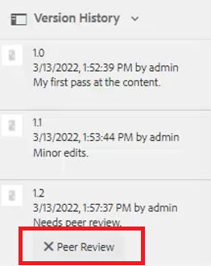

# Workflows zur einfachen Inhaltserstellung

Der AEM Guides-Editor verfügt über mehrere Tastaturbefehle, die den Arbeitsablauf für die Inhaltserstellung vereinfachen. Mit diesen Tastaturbefehlen können Benutzer schnell Bilder hinzufügen und ändern, mit mehreren Themen gleichzeitig arbeiten, Fehler korrigieren, Themenversionen herunterladen und mit PDF und Beschriftungen arbeiten.

>[!VIDEO](https://video.tv.adobe.com/v/342770?quality=12&learn=on)

## Bild hinzufügen

Bilder können direkt von einem lokalen Laufwerk aus hinzugefügt werden.

1. Ziehen Sie das Bild direkt in das Thema. Die **Hochladen von Assets** angezeigt.

   

1. Ändern Sie den Ordnerpfad zum gewünschten Bildspeicherort.

1. Ändern Sie den Namen des Bildes in einen für seinen Zweck repräsentativen Namen.

1. Klicken Sie auf [!UICONTROL **Hochladen**].

## Bild ändern

1. Ändern Sie die Größe eines Bildes durch Ziehen und Ablegen einer Ecke.

1. Verschieben Sie ein Bild durch Ziehen und Ablegen an eine andere Position innerhalb des Themas.

1. Verwendung **Inhaltseigenschaften** auf der rechten Seite, um die

   - scale

   - position

   - Ausrichtung oder

   - andere Attribute.

   

## Arbeiten mit mehreren Themen

Die Aufspaltungsansicht ist beim Vergleichen von Themen, beim Kopieren und Einfügen zwischen Themen oder beim Ziehen und Ablegen von Inhalten von einem Thema zum anderen hilfreich.

1. Öffnen Sie zwei oder mehr verwandte Themen.

1. Klicken Sie auf die Registerkarte Titel einer Datei, um das Kontextmenü zu öffnen.

1. Auswählen [!UICONTROL **Aufspaltung**].

1. Auswählen **Right**.

   

## Korrigieren typografischer Fehler

1. Suchen Sie das Wort oder die Wortgruppe, das/die den Fehler enthält.

1. Drücken und halten [!UICONTROL **Strg**].

1. Klicken Sie auf die sekundäre Maustaste auf den Fehler.

1. Wählen Sie die richtige Schreibweise aus.

Der Fehler wurde im Thementext korrigiert.

## Thema-PDF herunterladen

Benutzer können eine PDF des aktuellen Themas herunterladen, um sie zu markieren oder für andere freizugeben.

1. Klicken [!UICONTROL **Vorschau**] oben rechts auf dem Bildschirm.

1. Klicken Sie auf [!UICONTROL **PDF-Symbol**] über das Thema. Ein Dialogfeld wird angezeigt.

   

1. Füllen Sie die Informationen für **Name der Umwandlung** oder **DITA-OT-Befehlszeilenargumente** falls erforderlich. Beachten Sie, dass eine PDF immer noch generiert wird, wenn alle Felder leer gelassen werden.

1. Klicken Sie auf [!UICONTROL **Herunterladen**]. Die PDF generiert.

1. Verwenden Sie verfügbare Symbole, um das PDF-Thema zu konfigurieren, herunterzuladen oder freizugeben.

## Suchen Sie ein Thema im Repository oder in der Zuordnung

1. Öffnen Sie das Thema.

1. Klicken Sie auf die sekundäre Maustaste auf der Registerkarte Titel .

1. Auswählen **Suchen in**.

1. Wählen Sie entweder **Repository** oder **Zuordnung** , um zur gewünschten Themenposition zu springen.

## Thema verändern

1. Nehmen Sie eine Änderung an einem Thema vor.

1. Speichern Sie das Thema.

1. Klicken Sie auf **Repository** Symbol oben links im Menü.

   

1. Fügen Sie im Dialogfeld **Kommentare für neue Version**.

   

1. Klicken Sie auf [!UICONTROL **Speichern**].

Die Versionsnummer wird aktualisiert.

## Versionshinweise laden

Es kann schwierig sein, den Status eines Themas nur anhand der Versionsnummer zu verfolgen. Beschriftungen erleichtern die Identifizierung des genauen Zustands eines Themas, das mehrfach überarbeitet wurde.

1. Wählen Sie eine **Ordnerprofil**.

1. Konfigurieren Sie im Ordnerprofil den XML-Editor.

   a. Wählen Sie links oben im Bildschirm Bearbeiten aus.

   b. Fügen Sie unter &quot;Beschriftungen der XML-Inhaltsversion&quot;entweder ein neues Thema hinzu oder verwenden Sie ein vorhandenes.

   

1. Auswählen [!UICONTROL **Hochladen**].

1. Wählen Sie eine Datei wie ReviewLabels.json oder eine ähnliche. Weitere Informationen zum Erstellen einer solchen Datei finden Sie in einem anderen Video.

1. Klicken [!UICONTROL **Öffnen**].

1. Klicken [!UICONTROL **Speichern**] oben links im Bildschirm Ordnerprofil .

1. Klicken [!UICONTROL **Schließen**] oben rechts.

Versionsbeschriftungen werden jetzt geladen.

## Zuweisen von Versionsbeschriftungen

1. Versionsbeschriftungen laden.

1. Klicken Sie auf [!UICONTROL **Benutzereinstellungen**] Symbol oben links im aktuellen Thema.

   

1. Wählen Sie dasselbe Ordnerprofil aus, in das bereits Versionsbezeichnungen geladen wurden.

1. Stellen Sie im Dialogfeld Benutzereinstellungen sicher, dass der Basispfad auf dieselben Informationen verweist, auf die das Ordnerprofil angewendet wurde.

   

1. Klicken Sie auf [!UICONTROL **Speichern**].

1. Veröffentlichen Sie das Thema.

1. Fügen Sie einen Kommentar hinzu und wählen Sie eine Versionsbezeichnung aus der Dropdown-Liste aus.

   

1. Klicken Sie auf [!UICONTROL **Speichern**].

Die Versionsnummer wird aktualisiert.

## Versionsverlauf und Titel anzeigen

1. Suchen Sie im linken Bereich den aktuellen Thementitel.

1. Klicken Sie auf den Titel, um das Kontextmenü zu öffnen.

1. Auswählen [!UICONTROL **Anzeigen in der Assets-Benutzeroberfläche**].

   

   - Der Versionsverlauf mit Bezeichnungen wird auf der linken Seite angezeigt.

   

1. Klicken Sie auf eine Version, um auf Optionen wie **Auf diese Version zurücksetzen** und **Vorschau der Version**.

## Neue Vorlage erstellen

Es gibt Vorlagen für Themen und Maps. Administratoren können auf Vorlagen im linken Bereich zugreifen.

1. Klicken [!UICONTROL **Vorlagen**] im linken Bereich.

1. Wählen Sie entweder Karte oder Thema aus, um das zugehörige Kontextmenü zu öffnen.

1. Klicken Sie auf , um die neue Vorlage hinzuzufügen.

   

1. Füllen Sie die Felder im daraufhin angezeigten Dialogfeld aus.

Die Shell-Vorlage wird angezeigt, die Beispielinhalt und eine Beispielstruktur enthält.
