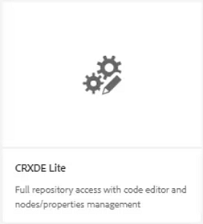
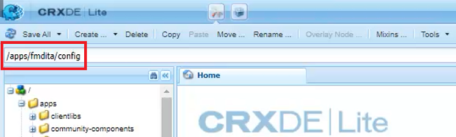
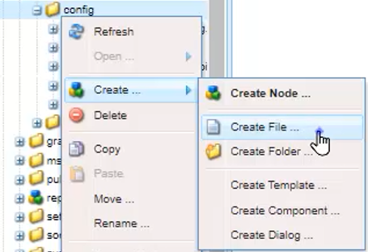
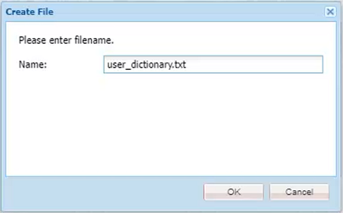
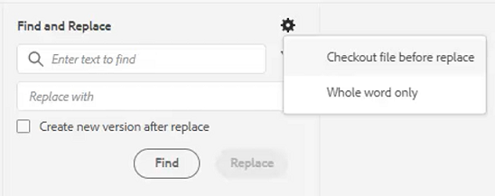
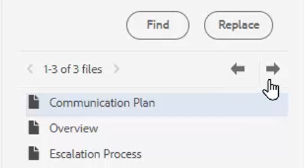

# Rechtschreibprüfung und Suchen/Ersetzen

Der AEM Guides-Editor verfügt über leistungsstarke Funktionen zum Überprüfen und Ersetzen von Rechtschreibfehlern.

>[!VIDEO](https://video.tv.adobe.com/v/342768)

Rechtschreibfehler korrigieren

1. Suchen Sie einen Fehler in einem offenen Thema, der mit einer roten Unterstreichung angezeigt wird.

2. Halten Sie die Strg-Taste gedrückt und klicken Sie auf die sekundäre Maustaste innerhalb des Wortes.

3. Wählen Sie die richtige Schreibweise aus den Vorschlägen aus.

Wenn die richtige Schreibweise nicht vorgeschlagen wird, können Sie das Wort immer manuell bearbeiten.

## Zur Rechtschreibprüfung AEM

Möglicherweise möchten Sie ein anderes Rechtschreibprüfungs-Tool als das Standardwörterbuch des Browsers verwenden.

1. Navigieren Sie zu **Editor-Einstellungen**.

2. Wählen Sie die **Allgemein** Registerkarte &quot;Einstellungen&quot;.

   

3. Dabei gibt es zwei Möglichkeiten:

   - **BrowserRechtschreibprüfung** - die Standardeinstellung, bei der die Rechtschreibprüfung das integrierte Wörterbuch des Browsers verwendet.

   - **Rechtschreibprüfung AEM** - Verwenden Sie dies, um mithilfe des benutzerdefinierten Wörterbuchs AEM eine benutzerdefinierte Wortliste zu erstellen.

4. Auswählen **Rechtschreibprüfung AEM**.

5. Klicken Sie auf [!UICONTROL **Speichern**].

Benutzerdefiniertes Wörterbuch konfigurieren

Der Administrator kann die Einstellungen ändern, sodass das AEM Wörterbuch benutzerdefinierte Wörter wie Firmennamen erkennt.

1. Navigieren Sie zum **Instrumente** -Bereich.

2. Anmelden bei **CRXDE Lite**.

   

3. Navigieren Sie zum **_/apps/fmdita/config-Knoten_**.

   

4. Erstellen Sie eine neue Datei.

   a. Klicken Sie mit der rechten Maustaste auf den Ordner config .

   b. Auswählen **Erstellen > Datei erstellen**.

   

   c. Benennen Sie die Datei. _**user_dictionary.txt**_.

   

   d. Klicken [!UICONTROL **OK**].

5. Öffnen Sie die Datei.

6. Fügen Sie eine Liste der Wörter hinzu, die Sie in Ihr benutzerdefiniertes Wörterbuch aufnehmen möchten.

7. Klicken Sie auf [!UICONTROL **Alle speichern**].

8. Schließen Sie die Datei.

Autoren müssen möglicherweise ihre Web-Editor-Sitzung neu starten, um die aktualisierte benutzerdefinierte Wortliste im AEM Wörterbuch zu erhalten.

## Suchen und Ersetzen in einer einzelnen Datei

1. Klicken Sie in der oberen Symbolleiste auf das Symbol Suchen und Ersetzen .

   

2. Geben Sie in der unteren Symbolleiste ein Wort oder eine Wortgruppe ein.

3. Klicken Sie auf [!UICONTROL **Suchen**].

4. Geben Sie bei Bedarf ein Wort ein, um das gefundene Wort zu ersetzen.

5. Klicken [!UICONTROL **Ersetzen**].

## Suchen und Ersetzen im gesamten Repository

1. Navigieren Sie zum **Repository**.

2. Klicken Sie auf [!UICONTROL **Suchen und Ersetzen**] unten links im Bildschirm.

3. Klicken Sie auf [!UICONTROL **Einstellungen anzeigen**] Symbol.

4. Wählen Sie entweder

   - **Checkout-Datei vor Ersetzen** — Wenn dies von einem Administrator aktiviert wird, wird die Datei automatisch ausgecheckt, bevor die Suchbegriffe ersetzt werden.

   - **Nur ganzes Wort** — beschränkt die Suche so, dass nur das genaue eingegebene Wort oder die eingegebene Wortgruppe zurückgegeben wird.

   

5. Klicken Sie auf [!UICONTROL **Filter anwenden**] -Symbol, um den Pfad im Repository auszuwählen, in dem Sie die Suche durchführen möchten.

6. Geben Sie die Begriffe zu Suchen und Ersetzen ein.

7. Wählen Sie bei Bedarf **Neue Version erstellen nach Ersetzen**.

8. Klicken Sie auf [!UICONTROL **Suchen**].

9. Öffnen Sie die gewünschte Datei und navigieren Sie mit den Pfeilen von einem gefundenen Ergebnis zum nächsten.

   
