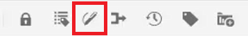
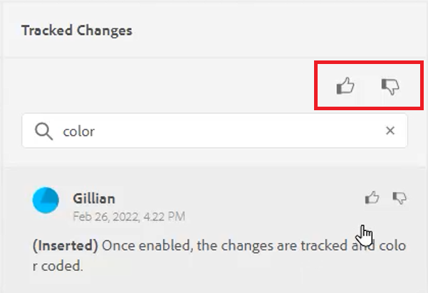
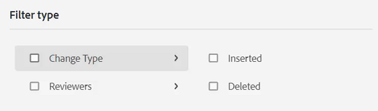
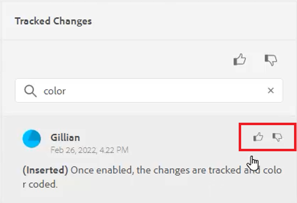
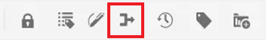

# Änderungen verfolgen

Sie können alle an einem Dokument vorgenommenen Aktualisierungen verfolgen, indem Sie den Modus Änderungen verfolgen aktivieren. Mit diesem Modus können Sie und Ihr Team alle Einfügungen und Löschungen während des Dokumentüberprüfungsprozesses erfassen.

>[!VIDEO](https://video.tv.adobe.com/v/342763?quality=12&learn=on)

## Arbeiten mit der Funktion &quot;Änderungen verfolgen&quot;

1. Umschalten zwischen **Änderungen verfolgen** Symbolleiste, um die Funktion zu aktivieren (oder zu deaktivieren).

   

2. Nehmen Sie eine Änderung am Thema vor.

   Hinzugefügte Inhalte werden nun grün mit einer Änderungsleiste angezeigt. Gelöschte Inhalte werden rot und durchgestrichen angezeigt.

3. Wählen Sie die **Getrackte Änderungen** rechts, um auf das Bedienfeld &quot;Getrackte Änderungen&quot;zuzugreifen.

   

4. Klicken Sie auf [!UICONTROL **Speichern**].

   

5. Schließen Sie das Thema.

Andere Benutzer können jetzt das Thema öffnen und die vorhandenen getrackten Änderungen anzeigen. Sie können die Änderungen akzeptieren oder ablehnen und ihre eigenen hinzufügen.

## Getrackte Änderungen durchsuchen

Die Suchfunktion ist hilfreich, wenn viele getrackte Änderungen vorgenommen wurden, da das Durchblättern zeitaufwendig sein kann.

1. Wählen Sie die **Getrackte Änderungen** rechts, um auf das Bedienfeld &quot;Getrackte Änderungen&quot;zuzugreifen.

2. Geben Sie ein Wort oder eine Wortgruppe in das Suchfeld ein.
Die Suche gibt alle Änderungen zurück, die mit den Suchbegriffen übereinstimmen.

## Getrackte Änderungen filtern

Mehrere getrackte Änderungen können auch durch Einfügen, Löschen oder Überprüfer gefiltert werden.

1. Klicken Sie auf [!UICONTROL **Filter**] unten im Bedienfeld &quot;Getrackte Änderungen&quot;angezeigt.

2. Aktivieren Sie die Kontrollkästchen für die gewünschten Filter.

   

3. Klicken Sie auf [!UICONTROL **Übernehmen**].

## Verfolgte Änderungen akzeptieren oder ablehnen

Überprüfer und Fachexperten können die Änderungen anderer Benutzer entweder einzeln oder alle gleichzeitig akzeptieren oder ablehnen.

1. Klicken Sie auf [!UICONTROL **Getrackte Änderungen**] rechts, um auf das Bedienfeld &quot;Getrackte Änderungen&quot;zuzugreifen.

2. Wählen Sie eine bestimmte Änderung aus.

3. Klicken Sie auf [!UICONTROL **Daumen nach oben**] oder [!UICONTROL **Nach unten**] mit der Änderung verknüpftes Symbol, um sie zu akzeptieren oder abzulehnen.

   

   Oder

   Klicken Sie auf [!UICONTROL **Daumen nach oben**] oder [!UICONTROL **Nach unten**] oberhalb der Suchleiste, um alle Änderungen zu akzeptieren oder abzulehnen.

   

4. [!UICONTROL **Speichern**] das Thema.

## Arbeiten mit der Funktion &quot;Zusammenführen&quot;

Wenn Sie in einer Umgebung mit mehreren Autoren arbeiten, kann es schwierig sein, die Änderungen zu verfolgen, die andere Autoren in einem Thema oder einer Zuordnung vorgenommen haben. Die Funktion Zusammenführen bietet Ihnen mehr Kontrolle darüber, ob die Änderungen angezeigt werden, aber auch, welche Änderungen in der neuesten Version des Dokuments beibehalten werden.

1. Öffnen Sie ein Thema im Web-Editor.

2. Klicken Sie auf [!UICONTROL **Zusammenführen**] in der Symbolleiste.

   

3. Wählen Sie im Dialogfeld Zusammenführen eine Version der Datei aus, mit der Sie die aktuelle Version der Datei vergleichen möchten.

4. Wählen Sie unter Optionen Folgendes aus:

   - **Änderungen von ausgewählter Version verfolgen**: Diese Option zeigt alle Inhaltsaktualisierungen in Form von getrackten Änderungen an. Sie können dann entscheiden, Änderungen im Dokument einzeln oder alle gleichzeitig zu akzeptieren oder abzulehnen.

   - **Auf ausgewählte Version zurücksetzen**: Mit dieser Option wird die aktuelle Version des Dokuments auf die ausgewählte Version zurückgesetzt. Sie haben keine Kontrolle darüber, welche Inhalte akzeptiert oder abgelehnt werden.

5. Klicken Sie auf [!UICONTROL **Fertig**].

Wenn Sie die Option **Option &quot;Änderungen von ausgewählter Version verfolgen&quot;** und dann werden alle Änderungen der ausgewählten Version auf der Registerkarte Änderungen im rechten Bereich angezeigt.
