# Benutzereinstellungen, Editor-Einstellungen und Editor-Symbolleisten

Der Editor verfügt über eine stark konfigurierbare Benutzeroberfläche. Durch die Kombination von Benutzereinstellungen, Editor-Einstellungen und Ordnerprofilen können Sie nahezu jeden Aspekt Ihrer Arbeitsumgebung anpassen.

>[!VIDEO](https://video.tv.adobe.com/v/342769?quality=12&learn=on)

## Element-Tags ein- oder ausblenden

Tags sind visuelle Hinweise, die die Grenzen eines Elements angeben. Eine Elementgrenze markiert den Anfang und das Ende eines Elements. Sie können diese Begrenzungen dann als visuellen Hinweis verwenden, um den Einfügepunkt zu platzieren oder den Text innerhalb einer Grenze auszuwählen.

1. Klicken Sie auf [!UICONTROL **Anzeigen von Tags ein/aus**] in der sekundären Symbolleiste.

   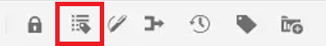

   Tags werden innerhalb des Themas angezeigt. Mit der Tag-Ansicht auf können Sie:

   - Wählen Sie den Inhalt eines Elements aus, indem Sie auf das öffnende oder schließende -Tag klicken.

   - Erweitern oder reduzieren Sie Tags, indem Sie auf das Pluszeichen (+) oder - im Tag klicken.

   - Über das Kontextmenü können Sie das ausgewählte Element ausschneiden, kopieren oder überwinden.

   - Ziehen Sie Elemente per Drag-and-Drop in den Arbeitsbereich, indem Sie das Tag auswählen und das Element an einer gültigen Position ablegen.

1. Klicken Sie auf [!UICONTROL **Anzeigen von Tags ein/aus**] erneut ein, um Tags auszublenden.

Tags werden nicht mehr angezeigt, sodass Sie sich auf den Text konzentrieren können.

## Assets bei Verwendung sperren

Durch das Sperren (oder Auschecken) einer Datei erhält der Benutzer exklusiven Schreibzugriff auf die Datei. Wenn die Datei entsperrt (oder eingecheckt) ist, werden die Änderungen in der aktuellen Version der Datei gespeichert.

1. Klicken Sie auf [!UICONTROL **Sperren**] in der sekundären Symbolleiste.

   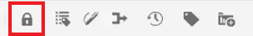

   Die Datei wurde ausgecheckt und ein Sperrsymbol wird neben dem Dateinamen im Repository angezeigt.

1. Klicken Sie auf [!UICONTROL **Entsperren**] Symbol.

   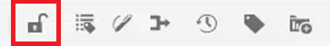

Das Repository wird aktualisiert und zeigt an, dass die Datei eingecheckt wurde.

## Sonderzeichen einfügen

1. Klicken Sie auf [!UICONTROL **Sonderzeichen einfügen**] in der sekundären Symbolleiste.

   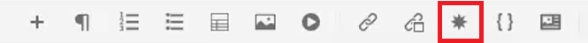

1. Geben Sie im Dialogfeld &quot;Sonderzeichen einfügen&quot;den Namen des Zeichens in die Suchleiste ein.

   Alternativ können Sie das Dropdown-Menü Kategorie auswählen verwenden, um alle Zeichen in einer bestimmten Kategorie anzuzeigen.

1. Wählen Sie das gewünschte Zeichen aus.

1. Klicken [!UICONTROL **Einfügen**].

Das Sonderzeichen wird in den Text eingefügt.

## Zwischen den Modi Autor, Quelle und Vorschau wechseln

In der Symbolleiste oben rechts im Bildschirm können Sie zwischen Ansichten wechseln.

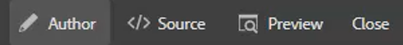

- Auswählen **Autor** , um die Struktur und den Inhalt während der Arbeit mit einem Thema anzuzeigen.

- Auswählen **Quelle** , um die zugrunde liegende XML anzuzeigen, aus der das Thema besteht.

- Auswählen **Vorschau** um anzuzeigen, wie ein Thema angezeigt wird, wenn ein Benutzer es in seinem Browser anzeigt.

## Design mit Benutzereinstellungen ändern

Sie können aus hellen oder dunklen Themen für den Editor wählen. Unter Verwendung des Themas Licht verwenden die Symbolleisten und Bedienfelder einen hellgrauen Hintergrund. Unter Verwendung des Themas &quot;Dunkel&quot;verwenden die Symbolleisten und Bedienfelder einen schwarzen Hintergrund. In beiden Designs wird der Inhaltsbearbeitungsbereich mit einem weißen Hintergrund angezeigt.

1. Klicken Sie auf [!UICONTROL **Benutzereinstellungen**] in der oberen Symbolleiste.

   

1. Klicken Sie im Dialogfeld &quot;Benutzereinstellungen&quot;auf das [!UICONTROL **Design**] Dropdown-Liste.

1. Wählen Sie aus den verfügbaren Optionen aus.

   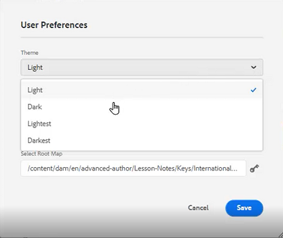

1. Klicken Sie auf [!UICONTROL **Speichern**].

Der Editor wird aktualisiert, um Ihr bevorzugtes Design anzuzeigen.

## Basispfad mit Benutzereinstellungen aktualisieren

Sie können den Basispfad so aktualisieren, dass die Repository-Ansicht Ihnen den Inhalt von einem bestimmten Speicherort anzeigt, sobald Sie den Editor starten. Dadurch wird der Zugriff auf Arbeitsdateien verkürzt.

1. Klicken Sie auf [!UICONTROL **Benutzereinstellungen**] in der oberen Symbolleiste.

   

1. Klicken Sie im Dialogfeld &quot;Benutzereinstellungen&quot;auf das [!UICONTROL **Ordner**] neben dem Basispfad.

   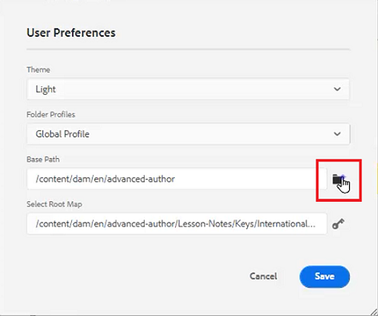

1. Klicken Sie im Dialogfeld Pfad auswählen auf das Kontrollkästchen neben einem bestimmten Ordner.

1. Klicken [!UICONTROL **Auswählen**].

Wenn Sie den Editor das nächste Mal starten, zeigt das Repository die Dateien an, die im Basispfad angegeben wurden.

## Neues Ordnerprofil zuweisen

Das globale Profil ist ein Systemstandard. Administratoren können zusätzliche Ordnerprofile erstellen, aus denen sie auswählen können.

1. Klicken Sie auf [!UICONTROL **Benutzereinstellungen**] in der oberen Symbolleiste.

   

1. Klicken Sie im Dialogfeld &quot;Benutzereinstellungen&quot;auf das [!UICONTROL **Ordnerprofile**] Dropdown-Liste.

   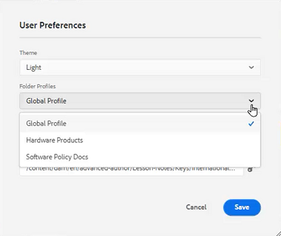

1. Wählen Sie aus den verfügbaren Optionen ein Profil aus.

1. Klicken Sie auf [!UICONTROL **Speichern**].

Das neue Ordnerprofil wird nun zugewiesen. Die Symbolleistenoptionen, Ansichtsmodi sowie Bedingungen und Snippets im linken Bereich wurden geändert. Sie kann auch das Erscheinungsbild von Inhalten im Editor ändern.

## Wörterbuch mit Editor-Einstellungen ändern

Die Editor-Einstellungen stehen Administratoren zur Verfügung. Mit diesen Voreinstellungen können Sie eine Reihe von Einstellungen konfigurieren, darunter das Wörterbuch, das der Editor für die Rechtschreibprüfung verwendet.

1. Klicken Sie auf [!UICONTROL **Editor-Einstellungen**] in der oberen Symbolleiste.

   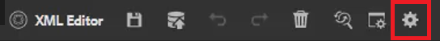

1. Klicken Sie im Dialogfeld &quot;Editor Settings&quot;auf das [!UICONTROL **Allgemein**] Registerkarte.

1. Wählen Sie das Wörterbuch aus, mit dem Sie arbeiten möchten.

1. Klicken Sie auf [!UICONTROL **Speichern**].

Das Wörterbuch wird aktualisiert. Beachten Sie, dass Sie beim Wechsel zu AEM Rechtschreibprüfung eine benutzerdefinierte Wortliste verwenden können.

## Anzeigen und Ausblenden von Bedienfeldern mit Editor-Einstellungen

Eine der Funktionen, die Sie mit den Editor-Einstellungen anpassen können, sind Bedienfelder. Im Einzelnen können Sie auswählen, welche Bedienfelder im Editor ein- oder ausgeblendet werden.

1. Klicken Sie auf [!UICONTROL **Editor-Einstellungen**] in der oberen Symbolleiste.

   

1. Klicken Sie im Dialogfeld &quot;Editor Settings&quot;auf das [!UICONTROL **Bedienfelder**] Registerkarte.

1. Schalten Sie die verfügbaren Bedienfelder ein/aus, um sie nach Bedarf ein- oder auszublenden.

   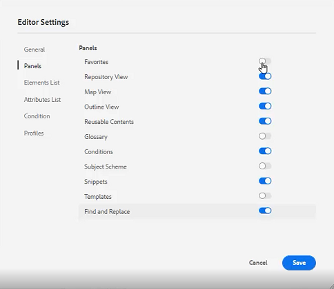

1. Klicken Sie auf [!UICONTROL **Speichern**].

Das linke Bedienfeld ist jetzt so konfiguriert, dass nur die Bedienfelder angezeigt werden, die zu &quot;Anzeigen&quot;umgeschaltet wurden.

## Name und Beschriftungselemente in den Editor-Einstellungen

Mit der Elementliste können Sie ein bestimmtes Element benennen und es mit einer benutzerfreundlicheren Bezeichnung versehen. Der Elementname sollte eines der DITA-Elemente sein. Die Bezeichnung kann eine beliebige Zeichenfolge sein.

1. Klicken Sie auf [!UICONTROL **Editor-Einstellungen**] in der oberen Symbolleiste.

   

1. Klicken Sie im Dialogfeld &quot;Editor Settings&quot;auf das [!UICONTROL **Elementliste**] Registerkarte.

1. Geben Sie eine **Elementname** und **Titel** in den entsprechenden Feldern.

1. Klicken Sie auf [!UICONTROL **Plus**] , um der Liste weitere Elemente hinzuzufügen.

   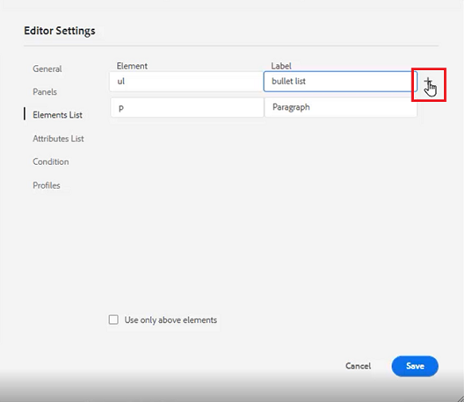

1. Klicken Sie auf [!UICONTROL **Speichern**].

Sie können die Änderung an der Elementliste sofort in den vorhandenen Tags im Editor sehen. Sie können sie auch in den verfügbaren Optionen sehen, wenn Sie ein neues Element hinzufügen.

## Name und Beschriftungsattribute in den Editor-Einstellungen

Die Attributliste funktioniert ähnlich wie die Elementliste. In den Editor-Einstellungen können Sie die Liste der Attribute und ihre Anzeigenamen steuern.

1. Klicken Sie auf [!UICONTROL **Editor-Einstellungen**] in der oberen Symbolleiste.

   

1. Klicken Sie im Dialogfeld &quot;Editor Settings&quot;auf das [!UICONTROL **Attributliste**] Registerkarte.

1. Geben Sie eine **Attributname** und **Titel** in den entsprechenden Feldern.

1. Klicken Sie auf [!UICONTROL **Plus**] , um der Liste weitere Attribute hinzuzufügen.

## Konfigurieren von Bedingungen in den Editor-Einstellungen

Auf der Registerkarte &quot;Bedingung&quot;können Sie verschiedene Eigenschaften konfigurieren.

1. Klicken Sie auf [!UICONTROL **Editor-Einstellungen**] in der oberen Symbolleiste.

   

1. Klicken Sie im Dialogfeld &quot;Editor Settings&quot;auf das [!UICONTROL **Bedingung**] Registerkarte.

1. Aktivieren Sie die Kontrollkästchen der Bedingungen, die Sie anwenden möchten.

   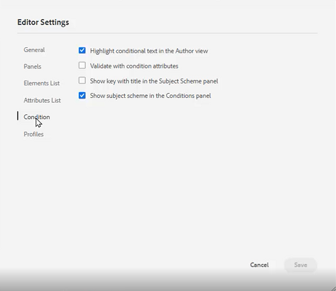

1. Klicken Sie auf [!UICONTROL **Speichern**].

## Erstellen eines Veröffentlichungsprofils in den Editor-Einstellungen

Veröffentlichungsprofile können zur Veröffentlichung der Wissensdatenbank verwendet werden. Salesforce verwendet beispielsweise eine konfigurierte App mit einem Consumer-Schlüssel und einem Consumer-Geheimnis. Diese Informationen können zum Erstellen eines Salesforce-Veröffentlichungsprofils verwendet werden.

1. Klicken Sie auf [!UICONTROL **Editor-Einstellungen**] in der oberen Symbolleiste.

   

1. Klicken Sie im Dialogfeld &quot;Editor Settings&quot;auf das [!UICONTROL **Profile**] Registerkarte.

1. Klicken Sie auf [!UICONTROL **Plus**] neben Profile.

1. Füllen Sie die Felder nach Bedarf aus.

1. Klicken Sie auf [!UICONTROL **Speichern**].

Ein Veröffentlichungsprofil wurde erstellt.
